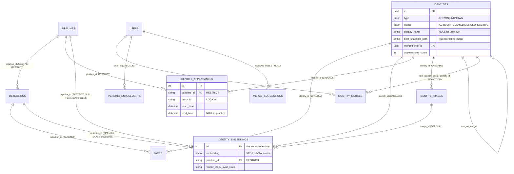
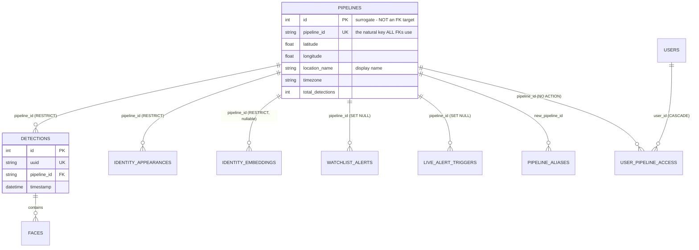
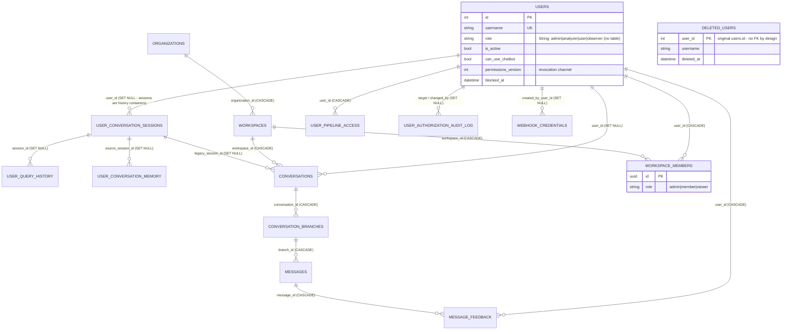
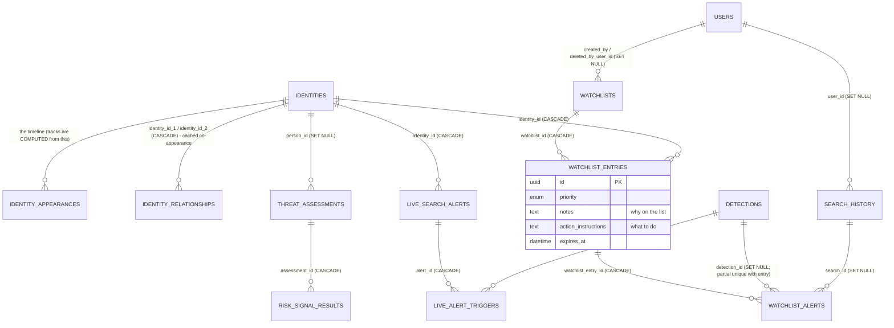
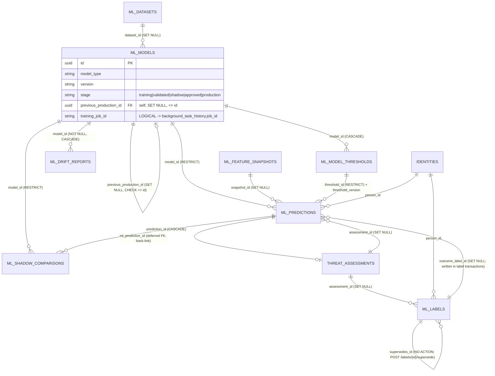

# Database Relationships — the 59 tables as one connected model (post-corrective-pass, head `f6a7b8c9d0e1`)

How every application table connects to every other one, proven from three
sources cross-checked against each other: the ORM (`db_models.py`, 59
`__tablename__` classes), the Alembic migrations (33 revisions, root `000_baseline`), and the
**live PostgreSQL constraints** (`information_schema` on the dev database).
Where a relationship exists only in code — an id column with no constraint —
it is marked **LOGICAL**, never described as enforced.

**Revision note (2026-08-16):** regenerated after the corrective implementation pass
(`Docs/88`): every FK/constraint the pass added is in §L, the deep dives describe
the single detection write path and the ML-Ops lineage as implemented, and §O
lists each 2026-08-15 concern with the policy that now resolves it.

Read this before touching any FK, writing a join, or reasoning about what a
delete takes with it.

---

## A. Overview

| | |
|---|---|
| Application tables | **59** (60 in the database including Alembic's own `alembic_version`) |
| ORM models | 59 — no ORM/DB drift in table count |
| Physical foreign keys | **90** (79 before the 2026-08-16 corrective pass) |
| Tables with no physical FK in or out | **12** (§K) |
| Root entities by fan-in | `users` (28 child FKs), `identities` (18), `pipelines` (7), `ml_models` (5), `threat_assessments` (4), `detections` (4), `user_conversation_sessions` (3) |
| Non-surrogate FK targets | `pipelines.pipeline_id` (String natural key — 7 FKs incl. RESTRICT from evidence tables) and `user_conversation_sessions.session_id` (String — 3 chat FKs) |
| Domains (derived from the schema) | 14 — §A.2 |

### A.1 The whole model in one paragraph

A **pipeline** *is* a camera. Each frame it sends becomes one **detection**;
each recognised face crop in that frame becomes one **face**. A person is an
**identity** (known or unknown — an unknown is a real row, not a flag on
faces). Every stored 512-d vector is one **identity_embedding**; pgvector
searches those, joined to `identities` for type/status. Each sighting also
writes an **identity_appearance** — the per-person timeline that cross-camera
tracking, the map, and "which camera saw this person" are all answered from
(they never touch `detections`). Enrolled photos are **identity_images**;
merges re-point embeddings/faces/appearances — and watchlist membership and
live alerts — to the winner and record provenance in **identity_merges**.
Watchlists reach identities through **watchlist_entries**; detection-time
matches are persisted as **watchlist_alerts** / **live_alert_triggers** inside
the detection transaction. Users own pipeline access, workspaces (via
**workspace_members**) own conversations, and every audit table keeps a
denormalised username plus a `historical_user_id` so history survives account
deletion. ML-ops is a separate registry (`ml_*`) that consumes identity
appearances and feeds `threat_assessments`; every prediction names its model,
threshold set, snapshot and (once labelled) its outcome.

### A.2 Domains

| # | Domain | Tables |
|---|---|---|
| 1 | Ingest & detection core | `pipelines`, `pipeline_aliases`, `detections`, `faces` |
| 2 | Identity layer | `identities`, `identity_appearances`, `identity_embeddings`, `identity_images`, `pending_enrollments` |
| 3 | Merge / clustering | `merge_suggestions`, `identity_merges` |
| 4 | Users, auth & access | `users`, `deleted_users`, `user_pipeline_access`, `webhook_credentials` |
| 5 | Audit trails | `user_authorization_audit_log`, `chatbot_audit_log`, `identity_audit_log`, `settings_audit_log`, `live_alert_audit_log`, `ml_audit_log`, `background_task_history` |
| 6 | Watchlists & live alerting | `watchlists`, `watchlist_entries`, `watchlist_alerts`, `live_search_alerts`, `live_alert_triggers` |
| 7 | Search & relationship intelligence | `search_history`, `identity_relationships` |
| 8 | SQL-agent history (legacy generation) | `user_query_history`, `user_conversation_sessions`, `user_conversation_memory`, `user_query_embeddings` |
| 9 | Tenancy & structured chat | `organizations`, `workspaces`, `workspace_members`, `conversations`, `conversation_branches`, `messages`, `message_feedback` |
| 10 | Risk engine | `threat_assessments`, `risk_signal_results`, `risk_model_versions`, `learned_thresholds` |
| 11 | ML feature / label / dataset pipeline | `ml_feature_definitions`, `ml_feature_snapshots`, `ml_collection_checkpoints`, `ml_labels`, `ml_datasets` |
| 12 | ML-ops registry & monitoring | `ml_models`, `ml_model_thresholds`, `ml_predictions`, `ml_shadow_comparisons`, `ml_drift_reports`, `ml_retraining_policies` |
| 13 | Legacy similarity ML | `similarity_training_data`, `similarity_model_registry` |
| 14 | Config, ops & telemetry | `settings`, `system_metrics` (+ `background_task_history`, `alembic_version`) |

Two facts that shape everything downstream: **there is no permissions table**
(roles are strings resolved to capabilities in code), and **there is no
`tracks`/`movements` table** (cross-camera tracks are computed on the fly from
`identity_appearances`; only co-appearance is cached).

---

## B. Master table inventory

Format: purpose · PK · physical FKs (`→ parent.col`, delete rule) · logical refs · notable constraints/lifecycle. Delete rules are the **live database** rules.

### Domain 1 — Ingest & detection core

**pipelines** — a camera/source: `pipeline_id` (String, unique — the natural key), `latitude`, `longitude`, `location_name` (display name; there is no `name`), `timezone`, `total_detections`, `is_active`. PK `id` (int) — but **no FK targets `id`; all target `pipeline_id`**. Children: `detections`, `user_pipeline_access`, `pipeline_aliases`. Lifecycle: `created_at`, `updated_at`.

**pipeline_aliases** — old→new id map for renamed cameras so stale webhook URLs still route. PK `old_pipeline_id` (String, deliberately unconstrained — it no longer exists). FK `new_pipeline_id → pipelines.pipeline_id` CASCADE. Accessed by raw SQL only.

**detections** — one row per processed **frame**, not per face. PK `id`. FK `pipeline_id → pipelines.pipeline_id` **RESTRICT** (NOT NULL; was CASCADE — one policy: a camera with evidence is deactivated, never hard-deleted). Unique `uuid`. (`image_path` was removed: full frames are never persisted — `faces.face_image_path` = sighting crop, `identity_images.storage_path` = enrolled gallery, `identities.best_snapshot_path` = representative.) Children: `faces` (CASCADE), `identity_embeddings.detection_id` (SET NULL), `watchlist_alerts.detection_id` (SET NULL), `live_alert_triggers.detection_id` (SET NULL). Lifecycle: `timestamp`.

**faces** — one recognised face crop within a detection. PK `id`. FKs `detection_id → detections.id` CASCADE (NOT NULL); `identity_id → identities.id` **SET NULL** (a face outlives its identity by design). `name` (display), `similarity`, `label_state`, `face_image_path` (the per-sighting crop file), bbox. No pipeline column — the camera is reached via `detection_id → detections.pipeline_id`. No uniqueness on `(name, detection_id)` by design.

### Domain 2 — Identity layer

**identities** — a person, known or unknown. PK `id` (UUID). `type` enum `KNOWN|UNKNOWN`; `status` enum `ACTIVE|PROMOTED|MERGED|INACTIVE`; `display_name` (NULL for unknowns — no name pattern); `person_code`/`person_code_key` (partial unique where not null); `best_snapshot_path` (**the representative image**); `appearances_count` (denormalised); `first_seen_at`, `last_seen_at`. Self-FK `merged_into_id → identities.id` NO ACTION (the merge tombstone pointer). Children: 18 FKs — see matrix.

**identity_appearances** — a per-person **timeline interval** (`start_time`/`end_time`), keyed by `(identity_id, pipeline_id, track_id)`. PK `id`. FKs `identity_id → identities.id` CASCADE (NOT NULL); `pipeline_id → pipelines.pipeline_id` **RESTRICT** (NOT NULL — camera evidence). `best_snapshot_path` per appearance. In practice ingest passes `track_id=None`, so every sighting is a new row with `end_time=NULL`. This is what tracking, the map and "which camera saw X" read.

**identity_embeddings** — one stored 512-d vector; the authoritative vector store for pgvector and any FAISS rebuild. PK `id` (**this int is the vector-index key** — there is no `faiss_id` column; it was dropped as always-NULL). FKs `identity_id → identities.id` CASCADE (NOT NULL); `detection_id → detections.id` SET NULL (exact provenance: written by `detection_evidence.link_embedding_to_detection` with the embedding id the frame produced — never inferred); `image_id → identity_images.id` SET NULL; `pipeline_id → pipelines.pipeline_id` **RESTRICT, nullable** — NULL means *not a camera sighting* (enrolled photo / preloaded gallery); a camera-origin embedding either ends with its exact `detection_id` or is removed (compensation on a failed detection, `identity_retention.reconcile_orphan_camera_embeddings` after a crash, grace `STALE_CAMERA_EMBEDDING_GRACE` = 10 min). `embedding Vector(512)` with HNSW cosine index; `faiss_index_type` ('known'/'unknown' — name is a relic, data is load-bearing); `quality`, `vector_index_sync_state` (pending|synced|failed), `embedding_model_version`.

**identity_images** — an enrollment photo. PK `id`. FKs `identity_id → identities.id` CASCADE (NOT NULL); `created_by → users.id` SET NULL. Unique `(identity_id, file_checksum)`; partial unique `identity_id WHERE is_primary` (one primary per identity). `storage_path`, `source_type` (upload|cropped_face|promotion), `processing_status`. Direction of the embedding link is `identity_embeddings.image_id → identity_images.id` (there is no `identity_images.embedding_id`).

**pending_enrollments** — an upload parked for an admin decision (checksum owner or similar identity found). PK `id`. FK `user_id → users.id` CASCADE (NOT NULL). Unique `token_hash`; `expires_at` NOT NULL. `candidates` JSONB is the frozen offer set (members re-verified live at confirm); the write-only `checksum_match_identity_id` column was removed. **Consumed by DELETE … RETURNING** on confirm; nothing durable exists while it is pending.

### Domain 3 — Merge / clustering

**merge_suggestions** — clustering output. PK `id`. FK `reviewed_by → users.id` SET NULL. `identity_ids` **JSONB array — the cluster payload, operational suggestion state, not a relational ref**: merges, retention INACTIVE transitions and hard deletes set every PENDING suggestion containing the id to `INVALIDATED` (`invalidated_reason`, `invalidated_at`) through one canonical `invalidate_merge_suggestions`; approve pre-checks every member is ACTIVE/PROMOTED and unmerged (409 `SUGGESTION_STALE`). `status` (PENDING|APPROVED|REJECTED|INVALIDATED), `confidence`, `reviewed_at`.

**identity_merges** — immutable merge audit + provenance for unmerge. PK `id`. FKs `from_identity_id → identities.id` NO ACTION (NOT NULL); `to_identity_id → identities.id` NO ACTION (NOT NULL); `merged_by → users.id` SET NULL. `historical_merged_by`, `merged_at` NOT NULL, `provenance` JSONB (appearance/embedding/face/image ids, paths, dedup links).

### Domain 4 — Users, auth & access

**users** — accounts. PK `id`. No FKs out. `role` is a **String** (canonical values `admin|analyzer|user|observer` live in `backend/auth/capabilities.py`; only `observer|user|analyzer` are assignable via API). `is_active`, `can_use_chatbot`, `blocked_reason`, `blocked_at`, `permissions_version` (revocation channel for long-lived connections), `must_change_password`. Unique `username`, `email`. 26 child FKs. The `system` principal (`role='system'`, `is_active=false`, unusable hash) is a machine actor for audit rows.

**deleted_users** — tombstone `user_id → username` written when an account is permanently deleted. PK `user_id` (the original `users.id`). **No FK in or out by design**; every `historical_*` column across the schema resolves against it. `deleted_by_user_id` LOGICAL.

**user_pipeline_access** — the user↔pipeline association. PK surrogate `id`; unique `(user_id, pipeline_id)`. FKs `user_id → users.id` CASCADE; `pipeline_id → pipelines.pipeline_id` **NO ACTION** (blocks pipeline deletion). Extra field `granted_at`.

**webhook_credentials** — machine ingest credentials (SHA-256 of token). PK `id`. FK `created_by_user_id → users.id` **SET NULL** (deliberate: cascading would black out a camera fleet when an employee leaves) + `created_by_username`. Unique `token_hash`, `name_key`. Revoke = DELETE.

### Domain 5 — Audit trails

All follow one pattern: actor FK `SET NULL` + denormalised username + `historical_user_id`; two drop FKs entirely.

| Table | Actor | Target | Notes |
|---|---|---|---|
| **identity_audit_log** | `user_id → users` SET NULL + `historical_user_id` + `username` NOT NULL | `identity_id`, `related_identity_id → identities` NO ACTION | `before_state`/`after_state` JSONB; `system` is a real actor distinct from NULL (= deleted human) |
| **chatbot_audit_log** | `user_id → users` SET NULL + `historical_user_id` + `username` | the query text itself; `session_id` LOGICAL | every SQL-agent denial lands here |
| **settings_audit_log** | `changed_by_user_id → users` SET NULL + `changed_by_username` | `setting_key` String — **no FK to `settings.key`** | also used for retention runs and webhook-credential events |
| **user_authorization_audit_log** | `changed_by_user_id → users` SET NULL + username (NULL = system/auto-block) | `target_user_id → users` SET NULL + `target_username`; `old_*`/`new_*` incl. `pipeline_ids` JSONB | written in the SAME transaction as the change; no read route |
| **live_alert_audit_log** | `user_id` **no FK** + `username` | `alert_id` **no FK** | zero FKs; best-effort own commit |
| **ml_audit_log** | `actor_user_id` **no FK** + `actor_username` | `object_type`+`object_id` polymorphic **no FK** | immutable by convention; excluded from retention |
| **background_task_history** | `created_by_user_id` **no FK** | `job_id` unique; four ML tables reference it **logically** | non-admins see only `notify_all_users` rows |

### Domain 6 — Watchlists & live alerting

**watchlists** — a list (VIP/threat/POI). PK `id` (UUID). FK `created_by → users.id` SET NULL. **Soft delete**: `deleted_at`, `deletion_reason`, `deleted_by_user_id → users.id` SET NULL, `version` (optimistic concurrency), `is_active`. Notification config columns.

**watchlist_entries** — the identity↔watchlist association. PK `id`. FKs `watchlist_id → watchlists.id` CASCADE; `identity_id → identities.id` CASCADE; `added_by → users.id` SET NULL. Unique `(watchlist_id, identity_id)`. Extra business fields: `priority`, `notes`, `action_instructions`, `expires_at`, `is_active`, `added_at`.

**watchlist_alerts** — alert history. PK `id`. FKs `watchlist_entry_id → watchlist_entries.id` CASCADE (NOT NULL — links to the entry, not directly to watchlist/identity); `detection_id → detections.id` SET NULL; `acknowledged_by → users.id` SET NULL; `search_id → search_history.id` SET NULL; `pipeline_id → pipelines.pipeline_id` SET NULL. `triggered_by` (search|detection|batch) — detection alerts are PERSISTED by `detection_evidence.persist_detection` (savepoint B) with `detection_id`, `pipeline_id`, `snapshot_path`, `similarity_score`; partial unique `uq_watchlist_alert_entry_detection (watchlist_entry_id, detection_id) WHERE detection_id IS NOT NULL` makes the write idempotent.

**live_search_alerts** — "notify me when this face appears again". PK `id`. FKs `identity_id → identities.id` CASCADE (NOT NULL); `created_by → users.id` SET NULL + `historical_created_by`. `pipeline_ids` **JSONB LOGICAL** (NULL = all). `status`, `expiration_type/date`, `last_triggered_at`.

**live_alert_triggers** — one firing. PK `id`. FKs `alert_id → live_search_alerts.id` CASCADE (NOT NULL); `detection_id → detections.id` SET NULL; `acknowledged_by → users.id` SET NULL; `pipeline_id → pipelines.pipeline_id` SET NULL. Partial unique `(alert_id, detection_id)` (migration) — written inside the detection transaction (savepoint A) so `detection_id` is always populated for detection-fired triggers.

### Domain 7 — Search & relationship intelligence

**search_history** — image-search audit/rerun. PK `id` (UUID). FK `user_id → users.id` SET NULL + `historical_user_id`. **No FK to identities or pipelines** — scope lives in `filters` JSONB, results in `results_summary` JSONB; `exclude_identity_ids`/`exclude_watchlist_ids` JSONB LOGICAL.

**identity_relationships** — the **persisted co-appearance cache**. PK `id`. FKs `identity_id_1`, `identity_id_2 → identities.id` CASCADE (both NOT NULL). Unique ordered pair. `co_appearance_count/percentage`, `relationship_strength`, `common_pipelines` JSONB (LOGICAL), `first/last_co_appearance`, `calculated_at`. Rebuilt wholesale per identity by a background job.

### Domain 8 — SQL-agent history (legacy generation)

**user_conversation_sessions** — session grouping. PK `id`. FK `user_id → users.id` CASCADE. `session_id` **unique** — yet nothing FKs to it.
**user_query_history** — every query + response. PK `id`. FK `user_id → users.id` SET NULL + `historical_user_id`; `session_id → user_conversation_sessions.session_id` SET NULL. Child: `user_query_embeddings` (CASCADE, 1:1 via unique `query_history_id`), `user_conversation_memory.source_query_id` (SET NULL).
**user_query_embeddings** — 384-d pgvector sidecar, **1:1** with a query. FKs `query_history_id → user_query_history.id` CASCADE (unique); `user_id → users.id` SET NULL.
**user_conversation_memory** — per-user facts/preferences with `expires_at`. FKs `user_id → users.id` CASCADE; `source_query_id → user_query_history.id` SET NULL; `source_session_id → user_conversation_sessions.session_id` SET NULL.

### Domain 9 — Tenancy & structured chat

**organizations** — top-level tenant. PK `id` (UUID). Unique `name`.
**workspaces** — isolation unit for conversations. PK `id`. FK `organization_id → organizations.id` CASCADE. Unique `(organization_id, name)`. **No owner column** — ownership is `workspace_members.role`.
**workspace_members** — user↔workspace association. PK `id`. FKs `workspace_id → workspaces.id` CASCADE; `user_id → users.id` CASCADE. Unique `(workspace_id, user_id)`. `role` String `admin|member|viewer` (deliberately not `users.role`; `viewer` is stored but never distinguished from `member` in code).
**conversations** — a chat thread, owned by one user, scoped to one workspace. PK `id`. FKs `workspace_id → workspaces.id` CASCADE (NOT NULL); `user_id → users.id` **SET NULL** + `author_username` + `historical_user_id` (orphaned chat stays readable to workspace admins, read-only). **Soft delete** `deleted_at`; `pinned`, `archived`, `last_message_at`. `legacy_session_id → user_conversation_sessions.session_id` SET NULL (bridge to the legacy chat generation).
**conversation_branches** — one linear message sequence (forking). PK `id`. FKs `conversation_id → conversations.id` CASCADE; `parent_branch_id → conversation_branches.id` SET NULL (self). `forked_from_message_id` **LOGICAL** (avoids a circular FK).
**messages** — one turn with typed content blocks. PK `id`. FK `branch_id → conversation_branches.id` CASCADE. Unique `(branch_id, sequence)`. `role` (user|assistant|system) — **no user column**; authorship is via the conversation. `edited_from_message_id` LOGICAL self-ref.
**message_feedback** — thumbs per user per message. FKs `message_id → messages.id` CASCADE; `user_id → users.id` CASCADE. Unique `(message_id, user_id)`.

### Domain 10 — Risk engine

**threat_assessments** — one persisted risk-engine output; the join point between identities, rules and ML. PK `id`. FKs `person_id → identities.id` SET NULL; `ml_prediction_id → ml_predictions.id` SET NULL (**`use_alter` deferred FK** breaking the assessments↔predictions cycle). `subject_id`/`subject_type` polymorphic LOGICAL, `pipeline_id` LOGICAL, `event_id` LOGICAL. Unique `idempotency_key`. `status`, `acknowledged_at`.
**risk_signal_results** — per-signal rows. FK `assessment_id → threat_assessments.id` CASCADE (NOT NULL).
**risk_model_versions** — config-driven weights per profile. **No FKs**; unique `(profile, version)`; `status` draft|active|retired.
**learned_thresholds** — learned cutpoints with activation lifecycle. **No FKs**; unique `(scope_type, scope_id, signal_name, version)`; `scope_id` LOGICAL (pipeline id or location).

### Domain 11 — ML feature / label / dataset pipeline

**ml_feature_definitions** — versioned feature defs. **No FKs**; unique `(name, version)`; `created_by` LOGICAL. Seeded ONLY by Alembic from a frozen literal (`d4e5f6a7b8c9`, 24 rows); `feature_store.verify_definitions()` at boot fails closed if the runtime inventory and the table disagree; a changed definition = a new version row in a new migration.
**ml_feature_snapshots** — point-in-time feature vector per entity. **No FKs**; unique `(entity_type, entity_id, feature_set_version, as_of_timestamp)`; `entity_id` **polymorphic LOGICAL** (identity UUID / pair / pipeline). Child: `ml_predictions.snapshot_id` SET NULL.
**ml_collection_checkpoints** — incremental-collection watermark. **No FKs**; unique `collector_name`.
**ml_labels** — reviewed labels. FKs `person_id → identities.id` SET NULL; `assessment_id → threat_assessments.id` SET NULL; `supersedes_id → ml_labels.id` NO ACTION (written by `POST /api/ml/labels/{id}/supersede`: the old row becomes `superseded`, the new active row points at it; outcome links re-point in the same transaction). `created_by`/`reviewed_by` are usernames (String). Unique `idempotency_key`.
**ml_datasets** — immutable checksummed dataset version. **No FKs**; unique `(name, version)`; `created_by`, `build_job_id` LOGICAL. Row-level lineage IS persisted: every Parquet row carries `snapshot_id` (+ `label_id` when supervised), the file is read back and checksummed after the atomic write, and `lineage_summary` JSONB records it.

### Domain 12 — ML-ops registry & monitoring

**ml_models** — the registry; stage graph training→validated→shadow→approved→production. FKs `dataset_id → ml_datasets.id` SET NULL; `previous_production_id → ml_models.id` SET NULL + CHECK `previous_production_id <> id`. `training_job_id`, `created_by` LOGICAL. Threshold SETS hang off it (`ml_model_thresholds`, CASCADE); prediction history references it with RESTRICT (a model with predictions is archived, never deleted). Unique `(model_type, version)`; partial uniques one-production / one-shadow per `model_type`; **CheckConstraint** `ck_ml_models_anomaly_shadow_cap` (anomaly models never approved/production). Eight lifecycle timestamps.
**ml_model_thresholds** — threshold SETS: one row = one cutpoint set (`cutpoints` JSONB `{elevated, unusual, highly_unusual}`, `quantiles`, `source` training|manual|recalibration, `sample_count`, `expected_metrics`, `notes`) per `(model_id, scope_type, scope_id, version)`; lifecycle `candidate → active → retired` (`activated_at/by`, `retired_at/by`). FK `model_id → ml_models.id` CASCADE (NOT NULL). Constraints: unique `(model, scope_type, scope_id, version)`; partial unique one `active` per (model, scope); `CHECK (scope_type='global') = (scope_id='')`; status / source / cutpoint-order CHECKs. Written by `backend/ml/threshold_service.py` (advisory-locked per model): training → candidate, shadow-approve → active (displaced shadow model's set retired), reject/archive/fail → retired. Inference bands with the ACTIVE set only.
**ml_predictions** — one persisted evaluation. FKs `person_id → identities` SET NULL; `model_id → ml_models` SET NULL; `snapshot_id → ml_feature_snapshots` SET NULL; `threshold_id → ml_model_thresholds` **RESTRICT** (the exact set the row was banded with; `threshold_version` = its label); `model_id` is **RESTRICT** too (f6a7b8c9d0e1) — a model / set with prediction history is archived / retired, never deleted; `assessment_id → threat_assessments` SET NULL; `outcome_label_id → ml_labels` SET NULL — written INSIDE label transactions (`outcome_label`, `outcome_recorded_at` alongside; candidates = assessment match ∪ same-subject UTC-day bucket; eligible = active & not disputed; rank manual > reviewed > newest); `event_time` = the assessment's `last_assessed`. Unique `idempotency_key`. Invariant: a successful shadow row always has `model_id`, `threshold_id`, `threshold_version` (write-time explicit failure rows otherwise; delete-time RESTRICT).
**ml_shadow_comparisons** — live rule decision vs shadow model. FKs `prediction_id → ml_predictions.id` CASCADE (NOT NULL); `model_id → ml_models.id` **RESTRICT**; `assessment_id` SET NULL. Back-links `threat_assessments.ml_prediction_id`.
**ml_drift_reports** — monitoring reports, one data + one prediction report PER SHADOW MODEL per run. FK `model_id → ml_models.id` **NOT NULL, CASCADE** (a report about a deleted model is meaningless); `scope_type='global'`, `scope_id=''` (the only supported scope); `GET /api/ml/drift/reports?model_id=` filters. No shadow model → nothing written (`{"skipped": "NO_SHADOW_MODEL"}`).
**ml_retraining_policies** — standalone lookup keyed by unique `model_type`; **no FK to `ml_models`**; `enabled=true` is refused with 409 by design.

### Domain 13 — Legacy similarity ML (a separate registry; no shared column with `ml_*`)

**similarity_training_data** — feedback on merge suggestions. FKs `identity_id_1`, `identity_id_2 → identities.id` NO ACTION; `created_by_user_id → users.id` SET NULL.
**similarity_model_registry** — versioned artifacts (candidate/active/archived). FK `created_by → users.id` SET NULL; `activated_by → users.id` SET NULL (symmetric with `created_by`).

### Domain 14 — Config, ops & telemetry

**settings** — current config values. **No FKs**; unique `key`. Also stores `ML_DECISION_MODE`.
**system_metrics** — performance samples. **No FKs**, no pipeline/user column; only `timestamp`.
**alembic_version** — Alembic-owned; not in `db_models.py`.

---

## C. Main relationship trees (plain English)

```
ONE pipeline (camera)
├── produces MANY detections                       [FK CASCADE]
│     └── each detection contains MANY faces        [FK CASCADE]
│           └── each face MAY belong to ONE identity [FK SET NULL]
├── has MANY identity_appearances                   [FK pipeline_id RESTRICT]
├── has MANY identity_embeddings                    [FK pipeline_id RESTRICT, NULL = enrolled/preloaded]
├── is granted to MANY users                        through user_pipeline_access [FK, NO ACTION on pipeline]
└── MAY have MANY pipeline_aliases                  [FK CASCADE]

ONE identity (person, known or unknown)
├── has MANY identity_embeddings                    [FK CASCADE]   ← the vectors pgvector searches
├── has MANY identity_appearances                   [FK CASCADE]   ← the timeline; tracking/map read THIS
├── has MANY identity_images                        [FK CASCADE]   ← enrolled photos
│     └── each image MAY have MANY embeddings       [embeddings.image_id → images.id, SET NULL]
├── is referenced by MANY faces                     [FK SET NULL]  ← faces outlive the identity
├── belongs to MANY watchlists                      through watchlist_entries [FK CASCADE both sides]
├── has MANY live_search_alerts                     [FK CASCADE]
├── co-appears with MANY identities                 through identity_relationships (ordered pair, cached)
├── MAY be merged INTO one identity                 [self-FK merged_into_id, NO ACTION]
├── has MANY identity_merges as from/to             [FK NO ACTION — blocks hard delete]
├── has MANY identity_audit_log rows                [FK NO ACTION]
├── has MANY threat_assessments / ml_predictions / ml_labels  [FK SET NULL]
└── appears in MANY similarity_training_data pairs  [FK NO ACTION]

ONE user
├── is granted MANY pipelines                       through user_pipeline_access [FK CASCADE]
├── is a member of MANY workspaces                  through workspace_members [FK CASCADE], with a workspace role
├── owns MANY conversations                         [FK SET NULL → orphaned chat survives, admin-readable]
├── has MANY user_query_history / sessions / memory / query_embeddings   [legacy chat; CASCADE or SET NULL]
├── has MANY message_feedback                       [FK CASCADE]
├── created MANY watchlists / entries / alerts / images / credentials     [FK SET NULL everywhere]
├── is the actor of MANY audit rows                 [FK SET NULL + historical_user_id + username]
├── has MANY pending_enrollments                    [FK CASCADE — in-flight, admin-bound]
└── leaves ONE deleted_users tombstone on deletion  [no FK; id → username]

ONE organization
└── has MANY workspaces                             [FK CASCADE]
      ├── has MANY workspace_members                [FK CASCADE]
      └── has MANY conversations                    [FK CASCADE]
            └── has MANY conversation_branches      [FK CASCADE, self parent_branch_id SET NULL]
                  └── has MANY messages             [FK CASCADE, unique (branch, sequence)]
                        └── has MANY message_feedback [FK CASCADE]

ONE watchlist
└── contains MANY identities                        through watchlist_entries (unique pair; entry carries
      │                                                priority, notes, action_instructions, expires_at)
      └── each entry has MANY watchlist_alerts     [FK CASCADE] — alerts hang off the ENTRY

ONE ml_dataset
└── trains MANY ml_models                           [FK SET NULL — the only physical FK in the training chain]
      ├── has MANY ml_model_thresholds              [FK CASCADE]
      ├── produces MANY ml_predictions              [FK SET NULL]
      │     └── each has MANY ml_shadow_comparisons [FK CASCADE]
      └── has MANY ml_drift_reports                 [FK SET NULL, never populated]

ONE threat_assessment
├── has MANY risk_signal_results                    [FK CASCADE]
├── MAY reference ONE ml_prediction                 [deferred FK, SET NULL]  ↔ predictions reference it back
├── has MANY ml_labels / ml_predictions / shadow_comparisons  [FK SET NULL]
└── belongs to ONE identity (person_id)             [FK SET NULL]
```

---

## D. Face / Identity deep dive

### D.1 The vocabulary — what each row IS

| Term | Table | One row is… |
|---|---|---|
| detection | `detections` | one processed **frame** from one camera (never per face) |
| face | `faces` | one recognised **face crop** inside a detection; carries the crop file path and, optionally, the identity |
| identity | `identities` | one **person**, known or unknown |
| embedding | `identity_embeddings` | one stored 512-d vector, owned by an identity |
| appearance | `identity_appearances` | one **sighting interval** of an identity at a camera |
| image | `identity_images` | one **enrolled photo** of a known identity |

Cardinalities, from the FKs: one detection has many faces (1→N); one face has at most one identity (N→1, optional); one identity has many faces, many embeddings, many appearances, many images (all 1→N). Nothing ties a face to a *specific* embedding — the link between them is `identity_embeddings.detection_id` (provenance) and `identity_embeddings.image_id` (enrollment), not `face_id`.

### D.2 The pipeline as implemented (`backend/services/image_processing.py`, `backend/core/batch_writer.py`)

```
webhook POST /webhook/{pipeline_id}    ← the URL parameter is the PERMANENT camera id
   ↓ (alias translation via pipeline_aliases; dedup; enqueue — the route writes NO rows)
process_image_async — per face:
   identity_service.find_or_create_identity(embedding, detection_id=None)
        → pgvector KNOWN search, then UNKNOWN search       (identity_embeddings ⋈ identities)
        → hit:  identities.last_seen_at updated  (+ optional enrichment embedding, OFF by default)
        → miss: INSERT identities (type=UNKNOWN, status=ACTIVE, display_name=NULL)
                INSERT identity_embeddings (index_type='unknown', detection_id=NULL)
   COMMIT                                                  ← identity + embedding exist BEFORE the detection
batch_writer._flush_internal — one bulk upsert, then ONE transaction PER DETECTION (`backend/core/detection_evidence.persist_detection`, also the direct-write path):
   TX1  INSERT pipelines … ON CONFLICT (pipeline_id) DO NOTHING                    (bulk)
   per detection:
        INSERT detections RETURNING id;  INSERT faces (detection_id, identity_id, face_image_path, …)
        CORE  create_appearance → INSERT identity_appearances; UPDATE identities counters/best snapshot
              link_embedding_to_detection(embedding_id carried from the frame, detection_id)
                 UPDATE identity_embeddings SET detection_id = :d WHERE id = :e AND detection_id IS NULL
                 → LINKED | ALREADY_LINKED | CROSS_LINK_REFUSED / EMBEDDING_MISSING (raise → whole TX rolls back)
        SAVEPOINT A  live-alert triggers (INSERT … ON CONFLICT (alert_id, detection_id) DO NOTHING)   — failure rolls back A only
        SAVEPOINT B  watchlist alerts  (INSERT … ON CONFLICT (watchlist_entry_id, detection_id) DO NOTHING) — failure rolls back B only
        UPDATE pipelines SET total_detections += 1
   COMMIT → broadcast `detection_alerts` (post-commit; a failed broadcast never touches rows)
   on CORE failure: rollback, then compensation deletes the embedding THIS frame created (ownership flag, never inferred)
```

So the true write order is **identities → identity_embeddings → pipelines → [detections → faces → identity_appearances → exact embedding back-link → alert rows → pipeline counter] as one atomic unit per detection**.

### D.3 Answers to the specific questions

* **Is one face tied to one identity?** A face has at most one identity (`faces.identity_id`, nullable, SET NULL). Many faces can point at the same identity.
* **Can one identity have many face observations / many embeddings?** Yes and yes — both are 1→N with CASCADE. Enrichment adds embeddings only when `IDENTITY_ENRICH_*` gates pass (off by default); enrollment adds one embedding per image.
* **Where are snapshots stored?** Three columns, one contract (`identity_service.py`): `faces.face_image_path` = per-sighting crop; `identity_appearances.best_snapshot_path` = per-appearance best; **`identities.best_snapshot_path` = the representative image** — for an enrolled known person it is the gallery primary and is **frozen against ingest**; for unknowns it is the best observed crop. Full frames are never persisted (`detections.image_path` is always NULL).
* **How are unknown people represented?** A real `identities` row with `type=UNKNOWN`, `status=ACTIVE`, `display_name=NULL`. The literal string "Unknown" appears only in `faces.name` and the on-disk folder. There is no `is_known` column.
* **How does unknown → known work?** `POST /admin/unknown/{id}/promote` → `identities.type=KNOWN, status=PROMOTED, display_name=<name>, person_code[_key]`; `identity_embeddings.faiss_index_type` flipped `'unknown'→'known'`; a gallery copy adopted into `identity_images` (`source_type='promotion'`) and `best_snapshot_path` re-pointed; `faces.name/label_state` updated. **Nothing moves between tables and no vector is re-indexed** — "promotion is a database fact". There is no `promoted_at` column; the audit row is `identity_audit_log` (`log_promote`), written after commit.
* **How does merge work?** `merge_identities(from, to)`: loser `identities.status=MERGED, merged_into_id=to`; `identity_images` consolidated (copied, re-parented, duplicates by checksum linked via `embeddings.image_id`); then blanket `UPDATE identity_appearances / identity_embeddings / faces SET identity_id = to`; winner `appearances_count` recounted; one `identity_merges` row with full `provenance` JSONB. **Vectors are not re-indexed** — the index key is `identity_embeddings.id`, unchanged; search excludes the loser by `identities.status`. **`watchlist_entries` are NOT re-pointed** (§O). Unmerge replays provenance and refuses multi-merges.
* **Which tables keep merge provenance/history?** `identity_merges` (from/to/merged_by/historical_merged_by/merged_at/provenance) and `identities.merged_into_id` on the loser (+ `merged_from` backref).
* **What happens to detections after merge?** Nothing — `detections` has no identity column. `faces.identity_id` is re-pointed to the winner.
* **How is vector search linked to identities?** Every search is `identity_embeddings ie JOIN identities i ON ie.identity_id = i.id`, filtered on `i.type` and `i.status IN ('ACTIVE','PROMOTED')`, cosine distance `<=>` on an HNSW index. The result is embedding **keys** (`ie.id`); resolving to a person is the caller's job.
* **How do pgvector/FAISS ids relate to DB records?** The contract (`backend/core/vector_index/base.py`): **the key is `identity_embeddings.id`** — never `identity_id`. There is no `faiss_id` column (dropped as always-NULL). Sync state lives in `identity_embeddings.vector_index_sync_state` + `embedding_model_version`; reconciliation compares key presence + model version + checksum, never `COUNT(*)` vs `ntotal`.

### D.4 Lifecycle fields on identities

`first_seen_at`, `last_seen_at` (bumped on every recognition), `created_at`, `updated_at`; `status` is the soft-lifecycle (ACTIVE→PROMOTED via promotion; →MERGED via merge; →INACTIVE via retention after `inactive_threshold_days`); `merged_into_id` is the tombstone pointer. There is **no** `deleted_at` on identities — hard delete exists only in maintenance scripts.

---

## E. Pipeline / Camera / Detection deep dive

**A pipeline is a camera.** `pipelines` holds `latitude`, `longitude`, `location_name`, `timezone` directly; there is no separate location table. `location_name` is the display name (there is no `name`); precedence is **admin/DB > webhook payload > NULL**, and ingest never clobbers an admin-set name.

```
pipelines.pipeline_id (String, unique — THE key)
   ├── detections.pipeline_id            FK RESTRICT     ← frames (was CASCADE)
   │      └── faces.detection_id         FK CASCADE      ← crops (camera reached via the detection)
   ├── identity_appearances.pipeline_id  FK RESTRICT     ← the timeline the map/tracking read
   ├── identity_embeddings.pipeline_id   FK RESTRICT     ← where each vector was captured (NULL = not a camera)
   ├── user_pipeline_access.pipeline_id  FK NO ACTION    ← who may see this camera
   ├── pipeline_aliases.new_pipeline_id  FK CASCADE      ← renamed-camera routing
   └── watchlist_alerts / live_alert_triggers .pipeline_id  FK SET NULL;  threat_assessments / ml_* .pipeline_id  LOGICAL (polymorphic scope; out of scope)
```

Auto-registration: first frame from an unknown `pipeline_id` upserts a `pipelines` row (`ON CONFLICT DO NOTHING`).

**"Which camera saw this person?"** is answered from **`identity_appearances`**, not `detections`:
`SELECT DISTINCT identity_id, pipeline_id FROM identity_appearances WHERE identity_id IN (…)`, with a fallback to `identity_embeddings.pipeline_id` for identities that have no appearance rows. The map/track joins appearances to `pipelines` for coordinates.

**Rename** is a move, not a delete: insert the new `pipelines` row copying metadata; `UPDATE … SET pipeline_id = new` across `detections, user_pipeline_access, identity_embeddings, identity_appearances, watchlist_alerts, live_alert_triggers`; delete the old row (allowed by RESTRICT only because every child was moved first — `tests/test_pipeline_integrity.py`); insert a `pipeline_aliases` row so old webhook URLs keep routing.

**Delete policy (2026-08-16):** a camera with evidence is **deactivated** (`is_active = 0`), never hard-deleted — `identity_appearances`, `identity_embeddings` and `detections` reference it with RESTRICT and `user_pipeline_access` with NO ACTION; only a camera with zero evidence can be removed. There is no delete route; wipe scripts pre-clear children. Enrolled / preloaded embeddings carry `pipeline_id NULL` (not a camera sighting), so a camera never owns gallery vectors.

---

## F. Tracking / Intelligence deep dive

**There is no persisted track.** `get_cross_camera_track` runs two selects — `identity_appearances` for the identity in the date window, ordered by `start_time`, then `pipelines` for coordinates — and computes grouping-by-day, `duration_at_location`, `total_cameras`, `total_duration_minutes` **on the fly**. `CrossCameraTrack`/`CrossCameraMovement` are in-memory dataclasses. It never touches `detections` or `faces`.

```
identity ─── identity_appearances (start_time, end_time, pipeline_id) ─── pipelines (lat/lon)
                       ↓ computed per request
             movement route · dwell time · camera sequence · map GeoJSON
```

**What IS persisted:** co-appearance, in `identity_relationships` — rebuilt per identity by `refresh_relationships` (delete-then-insert, smaller UUID first) from interval-overlap over `identity_appearances`, with `common_pipelines` and time patterns. Read first by `get_related_identities`, live-computed only if the cache is empty.

Risk overlays on the map (`threat_assessments`, patterns, heatmap) are computed by `SecurityMapAnalyzer` from the same appearances at request time; `threat_assessments` rows are written by the risk engine on events, not by the map.

---

## G. User / Authorization deep dive

```
users.role (String: admin|analyzer|user|observer)
   → canonical_role()  →  ROLE_CAPABILITIES (cumulative sets, in code — no permissions table)
   + can_use_chatbot   →  CHATBOT_USE / HISTORY_READ / HISTORY_DELETE
   − everything if !is_active
   → EffectiveAuthorization(permissions_version)  → require_capability()

parallel axis:  users ─── user_pipeline_access ─── pipelines   (admins bypass: all pipelines)
tenant axis:    organizations ─── workspaces ─── workspace_members(role) ─── conversations(user_id)
```

* Roles are **strings**, validated in code (`is_known_role` then assignable-set; `admin` is never assignable via API).
* User↔pipeline is **many-to-many** through `user_pipeline_access` (surrogate PK, unique pair, `granted_at`).
* Workspaces have **no owner column**; the only ownership signal is `workspace_members.role='admin'`. Deleting the last workspace admin is refused (409) unless a successor member is named.
* `permissions_version` is bumped on every authorization change and on block/unblock/auto-block; long-lived SQL-agent connections re-read it and drop when it changes.
* Blocking = `is_active=false, can_use_chatbot=false, blocked_reason, blocked_at` + a `user_authorization_audit_log` row (`user_blocked`) in the same transaction. Auto-block by the SQL agent goes through the same path.
* Deletion writes a `deleted_users` tombstone and stamps `historical_user_id` across seven tables before the FKs go NULL; the account's memberships/sessions/memory/feedback/pipeline-access CASCADE.

---

## H. Watchlist deep dive

`watchlists 1—* watchlist_entries *—1 identities` — an association table, so **many identities ↔ many watchlists**, unique per `(watchlist_id, identity_id)`. The entry is a first-class business record: `priority`, `notes` ("why they're on the list"), `action_instructions` ("what to do when detected"), `expires_at`, `is_active`, `added_by`. Alerts (`watchlist_alerts`) hang off the **entry**, not the watchlist or identity.

Matching (`check_identities_against_watchlists`) filters `entry.is_active AND (expires_at IS NULL OR > now)` and, in Python, `watchlist.is_active AND deleted_at IS NULL`. Watchlist deletion is **soft by default** (matching stops; entries/alerts preserved).

Reality (since the 2026-08-16 pass): image search writes `triggered_by='search'` rows; live detections write `triggered_by='detection'` rows INSIDE the per-detection transaction (`backend/core/detection_evidence.py`, savepoint B, idempotent on `(watchlist_entry_id, detection_id)`), and the `detection_alerts` WebSocket event is broadcast only after commit — the DB is authoritative (`GET /api/watchlist-alerts` returns `detection_id`). Merge re-points `watchlist_entries` to the winner (or retires the loser row in place when the winner already has the pair — its alerts stay); unmerge restores from provenance.

---

## I. ML-Ops deep dive

Three separate systems share the `identities` root but not each other:

| System | Tables | Entry |
|---|---|---|
| ML pipeline (new) | `ml_*` (11) | `/api/ml/*` |
| Similarity model (older) | `similarity_training_data`, `similarity_model_registry` | `/admin/merge-suggestions/*` |
| Risk platform | `threat_assessments`, `risk_signal_results`, `risk_model_versions`, `learned_thresholds` | `/api/security/*` |

ML pipeline lifecycle, with the physical FKs marked (post-pass):

```
identity_appearances ──collector──▶ ml_feature_snapshots (entity_id LOGICAL, unique 4-key; features never {})
                                    ml_collection_checkpoints (watermark, isolated)
ml_feature_definitions (24 rows, migration-frozen, verified at boot; feature_set_version LOGICAL) ──▶ snapshots
snapshots + ml_labels (joined in Python on subject_id==entity_id) ──▶ ml_datasets (Parquet rows carry snapshot_id [+label_id];
                                                                        read-back checksum; lineage_summary)
ml_datasets ══FK SET NULL══▶ ml_models ══FK CASCADE══▶ ml_model_thresholds (SETS; one active per scope)
ml_models ══FK RESTRICT══▶ ml_predictions ◀══FK RESTRICT══ ml_model_thresholds     (threshold_id + threshold_version + event_time)
ml_predictions ══FK CASCADE══▶ ml_shadow_comparisons ══FK RESTRICT══▶ ml_models
ml_predictions ══FK SET NULL══▶ ml_labels (outcome_label_id, written inside label transactions; supersedes_id chains)
ml_predictions ◀══deferred FK══ threat_assessments.ml_prediction_id (back-link after shadow write)
ml_models ══FK CASCADE (NOT NULL)══▶ ml_drift_reports (one data + one prediction report per shadow model)
ml_retraining_policies (model_type LOGICAL; enabled=true refused)
ml_audit_log (no FKs; every admin action incl. threshold_activate / threshold_retire / label_supersede)
```

Stage graph `training→validated→shadow→approved→production` is enforced three times: the transition table, `registry_service.transition`, and DB constraints (partial uniques for one production/one shadow per type; `ck_ml_models_anomaly_shadow_cap`). Every `/api/ml/*` route requires `ML_MANAGE` (admin only).

Route → table map: overview reads snapshots/predictions/drift/models/labels; `features/compute` writes snapshots+checkpoints+task history; `datasets` writes `ml_datasets` (+ Parquet with row lineage); `training-jobs` writes `background_task_history` then the job writes `ml_datasets`, `ml_models`, one candidate `ml_model_thresholds` set; `models/{id}/shadow-approve` mutates `ml_models` AND activates the threshold set atomically (retiring the displaced shadow model's set); `models/{id}/reject`, `shadow/stop` retire sets; `labels`, `labels/{id}/review`, `labels/{id}/supersede` write `ml_labels` and re-point `ml_predictions.outcome_*`; `drift/run` writes `ml_drift_reports` per shadow model; `predictions`, `shadow/summary`, `drift/reports` read their tables; every mutation writes `ml_audit_log`. Demo lineage: `scripts/seed_ml_ops_demo.py`; API-by-API proof: `tests/test_ml_ops_lineage.py`.

---

## J. Chatbot / Audit deep dive

**Two chat generations coexist and are dual-written, not migrated.** `persist_query_history` writes the legacy `user_conversation_sessions` + `user_query_history` synchronously (still the sidebar read path), then `record_exchange_for_session` into `conversations/branches/messages` in its own try/except, then background-enriches `user_conversation_memory` + `user_query_embeddings`. The bridge is **`conversations.legacy_session_id == user_query_history.session_id`** per user — a string equality, no FK either side.

Structured chat: `users ─── workspace_members ─── workspaces ─── conversations ─── conversation_branches ─── messages ─── message_feedback` — all physical CASCADE except `conversations.user_id` (SET NULL, so a deleted user's history survives, admin-readable read-only). Membership gate + ownership-in-the-WHERE; orphaned conversations get a separate read-only resolver.

Security: every SQL-agent denial → `chatbot_audit_log` (`success=false`, reason code; the rejected SQL never reaches the client); the violation counter is **Redis**, not a table; the third violation in an hour blocks the user (`users` mutation + `user_authorization_audit_log`, one transaction). Admins and `system` are exempt from the block but still audited.

Audit families and their linkage are tabulated in §B Domain 5. Retention sweeps `chatbot`, `identity`, `settings` audit logs and `background_task_history`; `user_authorization`, `live_alert` and `ml` audit logs are never swept.

---

## K. Association tables and isolated tables

**Association (many-to-many) tables** — all carry extra business fields, none is a bare join:

| A | ↔ | B | Table | Extra fields |
|---|---|---|---|---|
| users | ↔ | pipelines | `user_pipeline_access` | `granted_at` (surrogate PK, unique pair) |
| users | ↔ | workspaces | `workspace_members` | `role` (admin\|member\|viewer), `created_at` |
| identities | ↔ | watchlists | `watchlist_entries` | `priority`, `notes`, `action_instructions`, `expires_at`, `is_active`, `added_by`, `added_at` |
| identities | ↔ | identities | `identity_relationships` | `co_appearance_count/percentage`, `relationship_strength`, `common_pipelines`, time patterns |
| identities | ↔ | identities | `similarity_training_data` | `label`, `created_by_user_id` (training feedback pairs) |
| users | ↔ | messages | `message_feedback` | `rating`, comment (unique per pair) |

**Isolated tables (no physical FK in or out) — 12:**

| Table | Why | Accessed how |
|---|---|---|
| `alembic_version` | Alembic-owned | Alembic only |
| `settings` | key/value config | by `key`; `settings_audit_log.setting_key` references it logically |
| `system_metrics` | telemetry samples | by `timestamp` |
| `background_task_history` | job ledger | by `job_id` (unique); `ml_models.training_job_id`, `ml_datasets.build_job_id`, `ml_drift_reports.job_id`, `similarity_model_registry.training_job_id` reference it **logically** |
| `deleted_users` | tombstone | by `user_id`; every `historical_*` column resolves here logically |
| `learned_thresholds` | scoped by strings | `(scope_type, scope_id, signal_name)` |
| `risk_model_versions` | config per profile | `(profile, version)` |
| `ml_feature_definitions` | versioned defs | `(name, version)`; linked to snapshots by `feature_set_version` string |
| `ml_collection_checkpoints` | watermark | `collector_name` |
| `ml_retraining_policies` | policy per type | `model_type` (logically = `ml_models.model_type`) |
| `live_alert_audit_log` | audit that must survive alert deletion | `alert_id`, `user_id` unconstrained by design |
| `ml_audit_log` | audit, polymorphic target | `object_type`+`object_id` |

---

## L. Complete relationship matrix (90 physical FKs)

Live database delete rules (regenerated 2026-08-16 from `pg_constraint` on the development database at Alembic head `f6a7b8c9d0e1`; `tests/test_migration_schema_parity.py` proves a fresh `alembic upgrade head` database is identical). `null` = the FK column is nullable.

| Child.column | → Parent | Rule | null | Meaning |
|---|---|---|---|---|
| chatbot_audit_log.user_id | users | SET NULL | Y | who asked; survives deletion via historical_user_id + username |
| conversation_branches.conversation_id | conversations | CASCADE | N | branch belongs to one thread |
| conversation_branches.parent_branch_id | conversation_branches | SET NULL | Y | fork parent (self) |
| conversations.legacy_session_id | user_conversation_sessions | SET NULL | Y | bridge to the legacy chat generation; SET NULL |
| conversations.user_id | users | SET NULL | Y | owner; NULL = deleted human, admin-readable |
| conversations.workspace_id | workspaces | CASCADE | N | tenancy scope |
| detections.pipeline_id | pipelines | RESTRICT | N | frame's camera; RESTRICT (was CASCADE — one policy: cameras with evidence are deactivated, not deleted) |
| faces.detection_id | detections | CASCADE | N | crop inside this frame |
| faces.identity_id | identities | SET NULL | Y | recognised as; face outlives identity |
| identities.merged_into_id | identities | NO ACTION | Y | merge tombstone pointer |
| identity_appearances.identity_id | identities | CASCADE | N | timeline of this person |
| identity_appearances.pipeline_id | pipelines | RESTRICT | N | camera of the appearance interval; RESTRICT (evidence) |
| identity_audit_log.identity_id | identities | NO ACTION | Y | audited identity |
| identity_audit_log.related_identity_id | identities | NO ACTION | Y | e.g. merge counterpart |
| identity_audit_log.user_id | users | SET NULL | Y | actor |
| identity_embeddings.detection_id | detections | SET NULL | Y | provenance frame |
| identity_embeddings.identity_id | identities | CASCADE | N | vector belongs to person |
| identity_embeddings.image_id | identity_images | SET NULL | Y | vector came from this enrolled photo |
| identity_embeddings.pipeline_id | pipelines | RESTRICT | Y | camera the embedding was captured by; NULL = enrolled photo / preloaded gallery (not a camera sighting); RESTRICT: a camera with evidence is deactivated, never hard-deleted |
| identity_images.created_by | users | SET NULL | Y | uploader |
| identity_images.identity_id | identities | CASCADE | N | photo of this person |
| identity_merges.from_identity_id | identities | NO ACTION | N | loser |
| identity_merges.merged_by | users | SET NULL | Y | actor |
| identity_merges.to_identity_id | identities | NO ACTION | N | winner |
| identity_relationships.identity_id_1 | identities | CASCADE | N | co-appearance pair |
| identity_relationships.identity_id_2 | identities | CASCADE | N | co-appearance pair |
| live_alert_triggers.acknowledged_by | users | SET NULL | Y | operator who acknowledged; SET NULL keeps the trigger |
| live_alert_triggers.alert_id | live_search_alerts | CASCADE | N | firing of this alert |
| live_alert_triggers.detection_id | detections | SET NULL | Y | frame that fired it |
| live_alert_triggers.pipeline_id | pipelines | SET NULL | Y | where the trigger fired; SET NULL keeps trigger history |
| live_search_alerts.created_by | users | SET NULL | Y | creator; SET NULL — historical_created_by keeps the numeric id |
| live_search_alerts.identity_id | identities | CASCADE | N | watched person |
| merge_suggestions.reviewed_by | users | SET NULL | Y | reviewer; SET NULL |
| message_feedback.message_id | messages | CASCADE | N | feedback belongs to one message; CASCADE |
| message_feedback.user_id | users | CASCADE | N | personal; dies with account |
| messages.branch_id | conversation_branches | CASCADE | N | message belongs to one branch; CASCADE |
| ml_drift_reports.model_id | ml_models | CASCADE | N | model the drift was computed for — NOT NULL, CASCADE (a report about a deleted model is meaningless) |
| ml_labels.assessment_id | threat_assessments | SET NULL | Y | assessment the label was recorded against (manual labels need a RESOLVED one); SET NULL |
| ml_labels.person_id | identities | SET NULL | Y | labelled identity; SET NULL |
| ml_labels.supersedes_id | ml_labels | NO ACTION | Y | supersession chain: the corrected (new, active) label points at the superseded old one; NO ACTION keeps history |
| ml_models.dataset_id | ml_datasets | SET NULL | Y | trained on |
| ml_models.previous_production_id | ml_models | SET NULL | Y | direct predecessor (self); SET NULL + CHECK previous_production_id <> id |
| ml_model_thresholds.model_id | ml_models | CASCADE | N | cutpoints of a model |
| ml_predictions.assessment_id | threat_assessments | SET NULL | Y | assessment the prediction was made for; SET NULL (outcome candidates ∪ same-day bucket) |
| ml_predictions.model_id | ml_models | RESTRICT | Y | model that produced the prediction; RESTRICT — a model with prediction history is archived, never deleted (f6a7b8c9d0e1) |
| ml_predictions.outcome_label_id | ml_labels | SET NULL | Y | the eligible label that explains the prediction (assessment ∪ same-day bucket; manual > reviewed > newest); written inside label transactions |
| ml_predictions.person_id | identities | SET NULL | Y | predicted identity; SET NULL |
| ml_predictions.snapshot_id | ml_feature_snapshots | SET NULL | Y | features used |
| ml_predictions.threshold_id | ml_model_thresholds | RESTRICT | Y | exact threshold SET the prediction was banded with; RESTRICT (lineage is history) |
| ml_shadow_comparisons.assessment_id | threat_assessments | SET NULL | Y | assessment compared; SET NULL |
| ml_shadow_comparisons.model_id | ml_models | RESTRICT | Y | model of the comparison; RESTRICT |
| ml_shadow_comparisons.prediction_id | ml_predictions | CASCADE | N | the prediction it compares; CASCADE |
| pending_enrollments.user_id | users | CASCADE | N | admin-bound in-flight upload |
| pipeline_aliases.new_pipeline_id | pipelines | CASCADE | N | rename target; CASCADE |
| risk_signal_results.assessment_id | threat_assessments | CASCADE | N | assessment the signal contributed to; CASCADE |
| search_history.user_id | users | SET NULL | Y | searcher; SET NULL — historical_user_id keeps the numeric id |
| settings_audit_log.changed_by_user_id | users | SET NULL | Y | operator; SET NULL |
| similarity_model_registry.activated_by | users | SET NULL | Y | who activated the similarity model; SET NULL like created_by |
| similarity_model_registry.created_by | users | SET NULL | Y | creator; SET NULL |
| similarity_training_data.created_by_user_id | users | SET NULL | Y | labeller; SET NULL |
| similarity_training_data.identity_id_1 | identities | NO ACTION | Y | pair member; NO ACTION blocks identity hard-delete while training pairs exist |
| similarity_training_data.identity_id_2 | identities | NO ACTION | Y | pair member; NO ACTION (as above) |
| threat_assessments.ml_prediction_id | ml_predictions | SET NULL | Y | deferred (use_alter) |
| threat_assessments.person_id | identities | SET NULL | Y | assessed identity; SET NULL |
| user_authorization_audit_log.changed_by_user_id | users | SET NULL | Y | actor; SET NULL (audit survives) |
| user_authorization_audit_log.target_user_id | users | SET NULL | Y | subject; SET NULL (audit survives) |
| user_conversation_memory.source_query_id | user_query_history | SET NULL | Y | query the memory came from; SET NULL |
| user_conversation_memory.source_session_id | user_conversation_sessions | SET NULL | Y | session the memory was distilled from; SET NULL |
| user_conversation_memory.user_id | users | CASCADE | N | owner; CASCADE (memory is not history) |
| user_conversation_sessions.user_id | users | SET NULL | Y | owner; SET NULL — sessions are history containers like the rows they group |
| user_pipeline_access.pipeline_id | pipelines | NO ACTION | N | grant target; NO ACTION blocks camera hard-delete while grants exist |
| user_pipeline_access.user_id | users | CASCADE | N | grantee; CASCADE |
| user_query_embeddings.query_history_id | user_query_history | CASCADE | N | 1:1 (unique) |
| user_query_embeddings.user_id | users | SET NULL | Y | owner; CASCADE |
| user_query_history.session_id | user_conversation_sessions | SET NULL | Y | grouping session; SET NULL |
| user_query_history.user_id | users | SET NULL | Y | asker; SET NULL — history outlives the account |
| watchlist_alerts.acknowledged_by | users | SET NULL | Y | operator; SET NULL keeps the alert |
| watchlist_alerts.detection_id | detections | SET NULL | Y | the detection that raised it (triggered_by=detection); SET NULL; partial unique with watchlist_entry_id |
| watchlist_alerts.pipeline_id | pipelines | SET NULL | Y | where the detection-triggered alert fired; SET NULL keeps alert history |
| watchlist_alerts.search_id | search_history | SET NULL | Y | the image search that raised it (search_history); SET NULL — retention deletes searches, alerts stay |
| watchlist_alerts.watchlist_entry_id | watchlist_entries | CASCADE | N | alert hangs off the entry |
| watchlist_entries.added_by | users | SET NULL | Y | operator; SET NULL |
| watchlist_entries.identity_id | identities | CASCADE | N | member identity; CASCADE (merge re-points, never deletes: alerts hang off the entry) |
| watchlist_entries.watchlist_id | watchlists | CASCADE | N | the list; CASCADE |
| watchlists.created_by | users | SET NULL | Y | creator; SET NULL |
| watchlists.deleted_by_user_id | users | SET NULL | Y | who soft-deleted the list; SET NULL like created_by |
| webhook_credentials.created_by_user_id | users | SET NULL | Y | deliberate: not CASCADE |
| workspace_members.user_id | users | CASCADE | N | member; CASCADE |
| workspace_members.workspace_id | workspaces | CASCADE | N | workspace; CASCADE |
| workspaces.organization_id | organizations | CASCADE | N | tenant; CASCADE |

## M. Mermaid ER diagrams

Cardinality is verified: `||--o{` = one-to-many, `}o--||` = many-to-one, `||--||` = one-to-one.

### M.1 High-level — every table, grouped (FK edges only)

```mermaid
erDiagram
    PIPELINES ||--o{ DETECTIONS : produces
    PIPELINES ||--o{ PIPELINE_ALIASES : renamed_to
    PIPELINES ||--o{ USER_PIPELINE_ACCESS : granted_via
    PIPELINES ||--o{ IDENTITY_APPEARANCES : evidence_from
    PIPELINES ||--o{ IDENTITY_EMBEDDINGS : captured_by
    PIPELINES ||--o{ WATCHLIST_ALERTS : fired_at
    PIPELINES ||--o{ LIVE_ALERT_TRIGGERS : fired_at
    DETECTIONS ||--o{ FACES : contains
    DETECTIONS ||--o{ IDENTITY_EMBEDDINGS : provenance_of
    DETECTIONS ||--o{ WATCHLIST_ALERTS : fired_by
    DETECTIONS ||--o{ LIVE_ALERT_TRIGGERS : fired_by
    IDENTITIES ||--o{ FACES : recognised_as
    IDENTITIES ||--o{ IDENTITY_EMBEDDINGS : has
    IDENTITIES ||--o{ IDENTITY_APPEARANCES : timeline
    IDENTITIES ||--o{ IDENTITY_IMAGES : enrolled_photos
    IDENTITIES ||--o{ WATCHLIST_ENTRIES : listed_in
    IDENTITIES ||--o{ LIVE_SEARCH_ALERTS : watched_by
    IDENTITIES ||--o{ IDENTITY_RELATIONSHIPS : co_appears
    IDENTITIES ||--o{ IDENTITY_MERGES : from_or_to
    IDENTITIES ||--o{ IDENTITY_AUDIT_LOG : audited
    IDENTITIES ||--o{ SIMILARITY_TRAINING_DATA : pair
    IDENTITIES ||--o{ THREAT_ASSESSMENTS : person
    IDENTITIES ||--o{ ML_PREDICTIONS : person
    IDENTITIES ||--o{ ML_LABELS : person
    IDENTITIES ||--o| IDENTITIES : merged_into
    IDENTITY_IMAGES ||--o{ IDENTITY_EMBEDDINGS : source_of
    USERS ||--o{ USER_PIPELINE_ACCESS : granted
    USERS ||--o{ WORKSPACE_MEMBERS : member
    USERS ||--o{ CONVERSATIONS : owns
    USERS ||--o{ MESSAGE_FEEDBACK : gives
    USERS ||--o{ USER_QUERY_HISTORY : asked
    USERS ||--o{ USER_CONVERSATION_SESSIONS : has
    USER_CONVERSATION_SESSIONS ||--o{ USER_QUERY_HISTORY : groups
    USER_CONVERSATION_SESSIONS ||--o{ USER_CONVERSATION_MEMORY : distilled_from
    USER_CONVERSATION_SESSIONS ||--o{ CONVERSATIONS : legacy_bridge
    USERS ||--o{ USER_CONVERSATION_MEMORY : has
    USERS ||--o{ USER_QUERY_EMBEDDINGS : has
    USERS ||--o{ PENDING_ENROLLMENTS : uploaded
    USERS ||--o{ WEBHOOK_CREDENTIALS : issued
    USERS ||--o{ WATCHLISTS : created
    USERS ||--o{ WATCHLIST_ENTRIES : added
    USERS ||--o{ WATCHLIST_ALERTS : acknowledged
    USERS ||--o{ LIVE_SEARCH_ALERTS : created
    USERS ||--o{ LIVE_ALERT_TRIGGERS : acknowledged
    USERS ||--o{ SEARCH_HISTORY : searched
    SEARCH_HISTORY ||--o{ WATCHLIST_ALERTS : raised_by_search
    USERS ||--o{ WATCHLISTS : soft_deleted_by
    USERS ||--o{ IDENTITY_IMAGES : uploaded
    USERS ||--o{ IDENTITY_MERGES : merged_by
    USERS ||--o{ MERGE_SUGGESTIONS : reviewed
    USERS ||--o{ SIMILARITY_TRAINING_DATA : labelled
    USERS ||--o{ SIMILARITY_MODEL_REGISTRY : created
    USERS ||--o{ SIMILARITY_MODEL_REGISTRY : activated
    USERS ||--o{ IDENTITY_AUDIT_LOG : actor
    USERS ||--o{ CHATBOT_AUDIT_LOG : actor
    USERS ||--o{ SETTINGS_AUDIT_LOG : actor
    USERS ||--o{ USER_AUTHORIZATION_AUDIT_LOG : actor_or_target
    ORGANIZATIONS ||--o{ WORKSPACES : has
    WORKSPACES ||--o{ WORKSPACE_MEMBERS : has
    WORKSPACES ||--o{ CONVERSATIONS : scopes
    CONVERSATIONS ||--o{ CONVERSATION_BRANCHES : has
    CONVERSATION_BRANCHES ||--o{ MESSAGES : has
    CONVERSATION_BRANCHES ||--o{ CONVERSATION_BRANCHES : parent
    MESSAGES ||--o{ MESSAGE_FEEDBACK : has
    USER_QUERY_HISTORY ||--|| USER_QUERY_EMBEDDINGS : embedding
    USER_QUERY_HISTORY ||--o{ USER_CONVERSATION_MEMORY : source
    WATCHLISTS ||--o{ WATCHLIST_ENTRIES : contains
    WATCHLIST_ENTRIES ||--o{ WATCHLIST_ALERTS : triggers
    LIVE_SEARCH_ALERTS ||--o{ LIVE_ALERT_TRIGGERS : fires
    THREAT_ASSESSMENTS ||--o{ RISK_SIGNAL_RESULTS : signals
    THREAT_ASSESSMENTS ||--o{ ML_PREDICTIONS : evaluated
    THREAT_ASSESSMENTS ||--o{ ML_SHADOW_COMPARISONS : compared
    THREAT_ASSESSMENTS ||--o{ ML_LABELS : labelled
    ML_PREDICTIONS ||--o| THREAT_ASSESSMENTS : back_link
    ML_DATASETS ||--o{ ML_MODELS : trained
    ML_MODELS ||--o{ ML_MODEL_THRESHOLDS : cutpoints
    ML_MODELS ||--o{ ML_PREDICTIONS : produced
    ML_MODELS ||--o| ML_MODELS : previous_production
    ML_LABELS ||--o{ ML_PREDICTIONS : outcome
    ML_LABELS ||--o{ ML_LABELS : supersedes
    ML_MODELS ||--o{ ML_SHADOW_COMPARISONS : shadow
    ML_MODELS ||--o{ ML_DRIFT_REPORTS : monitored
    ML_PREDICTIONS ||--o{ ML_SHADOW_COMPARISONS : compared
    ML_FEATURE_SNAPSHOTS ||--o{ ML_PREDICTIONS : features
    ML_MODEL_THRESHOLDS ||--o{ ML_PREDICTIONS : threshold
```


Isolated (no FK edge): `settings`, `system_metrics`, `background_task_history`, `deleted_users`, `learned_thresholds`, `risk_model_versions`, `ml_feature_definitions`, `ml_collection_checkpoints`, `ml_retraining_policies`, `live_alert_audit_log`, `ml_audit_log`, `alembic_version`.

### M.2 Identity / Face



### M.3 Camera / Pipeline


Physical FKs into `pipelines.pipeline_id`: `identity_appearances` (RESTRICT), `identity_embeddings` (RESTRICT, nullable), `detections` (RESTRICT), `user_pipeline_access` (NO ACTION), `watchlist_alerts` / `live_alert_triggers` (SET NULL). Logical (no FK, polymorphic scope): `threat_assessments`, `ml_predictions`, `ml_shadow_comparisons`.

### M.4 User / Auth / Tenancy



### M.5 Intelligence / Tracking / Watchlists



### M.6 ML-Ops / System


Isolated ML/system: `ml_feature_definitions` (→ snapshots by `feature_set_version` string), `ml_collection_checkpoints`, `ml_retraining_policies` (→ `ml_models.model_type` string), `learned_thresholds`, `risk_model_versions`, `settings`, `system_metrics`, `background_task_history` (← job ids), `ml_audit_log`, `live_alert_audit_log`.

---

## N. Workflow examples (actual table paths)

**A. Camera detects an unknown person**
`POST /webhook/{pipeline_id}` → (queue) → pgvector KNOWN then UNKNOWN search on `identity_embeddings ⋈ identities` → miss → `INSERT identities (UNKNOWN, ACTIVE)` + `INSERT identity_embeddings (index_type='unknown')` → commit → `pipelines` upsert → ONE transaction (`detection_evidence.persist_detection`): `INSERT detections` → `INSERT faces (identity_id, face_image_path=<crop>)` → `INSERT identity_appearances` + `identities.appearances_count++`, `best_snapshot_path` set → `identity_embeddings.detection_id` back-linked with the EXACT embedding id the frame produced (`LINKED`; a cross-link is refused and rolls the whole detection back) → savepoint A live-alert triggers / savepoint B watchlist alerts (idempotent) → `pipelines.total_detections++` → commit → `detection_alerts` WebSocket event.

**B. Unknown person recognised later**
Same search hits the unknown → `identities.last_seen_at` bumped → new `detections`/`faces`/`identity_appearances` rows for this sighting → possibly a new enrichment `identity_embeddings` row (off by default). Nothing else changes; the identity is still UNKNOWN.

**C. Promote unknown → known**
`POST /admin/unknown/{id}/promote` → `identities.type=KNOWN, status=PROMOTED, display_name, person_code` → `identity_embeddings.faiss_index_type='known'` (same rows, no re-index) → `identity_images` gains an adopted gallery copy; `identities.best_snapshot_path` and `identity_appearances.best_snapshot_path` re-pointed → `faces.name/label_state` updated → after commit `identity_audit_log` row (`log_promote`, before/after state).

**D. Add an image to a known person**
`POST /api/identities/{id}/images` (bypasses `pending_enrollments`) → one transaction: `INSERT identity_images (checksum-unique; first image `is_primary`)` → `INSERT identity_embeddings (pipeline_id=NULL — not a camera sighting)` → set `identity_embeddings.image_id = image.id` → `identities.last_seen_at`, `best_snapshot_path` if primary → file `os.replace` last → commit → index sync. Result: **new image + new embedding, same identity**. The name-based upload path instead parks a `pending_enrollments` row (nothing durable) until confirm consumes it by `DELETE … RETURNING`.

**E. Merge identities**
`POST /admin/identities/merge` (or approving a `merge_suggestions` row) → gate → loser `identities.status=MERGED, merged_into_id=winner` → `identity_images` consolidated (copy/re-parent; checksum duplicates linked via `identity_embeddings.image_id`) → `UPDATE identity_appearances / identity_embeddings / faces SET identity_id=winner` → winner `appearances_count` recounted → `INSERT identity_merges (from, to, merged_by, provenance JSONB)`. `detections` untouched (no identity column); vectors not re-indexed; `watchlist_entries` re-pointed to the winner (or the loser row retired in place when the winner already has the pair — its alerts stay), `live_search_alerts` moved, PENDING `merge_suggestions` containing the loser set to `INVALIDATED`; provenance records `watchlist_entry_moves` / `live_alert_ids` so unmerge can restore.

**F. Search person by uploaded image**
Advanced search: embed the upload → `identity_embeddings ⋈ identities` (KNOWN + UNKNOWN pgvector) → collapse best-per-identity → hydrate `identities` → optional filter through `identity_appearances` (camera/date) → `watchlist_entries ⋈ watchlists` check on the **unfiltered** ranking → `search_audit.record_image_search` (`INSERT search_history`; `input_image_hash` = sha256 of the upload) (+ `INSERT watchlist_alerts (triggered_by='search', search_id → search_history FK)` for hits) → results. `/search/by-image` runs the same search and the SAME audit writer (one row per call, even for zero results; the row id is returned in the `X-Search-Id` header; the body stays a bare array).

**G. Track a person across cameras**
`GET /api/identities/{id}/cross-camera` → `SELECT identity_appearances WHERE identity_id AND start_time IN window ORDER BY start_time` → `SELECT pipelines WHERE pipeline_id IN (…)` for coordinates → group by day, compute dwell/transitions in Python → nothing persisted. The map endpoint (`/map-data`) does the same and adds `threat_assessments`-style risk and pattern analysis on the fly.

**H. Add person to watchlist**
`POST /api/watchlists/{id}/entries` → `INSERT watchlist_entries (watchlist_id, identity_id, priority, notes, action_instructions, expires_at, added_by)` (or reactivate an existing pair) → future searches/detections join `watchlist_entries ⋈ watchlists` where entry and list are active and not expired/deleted.

**I. User asks the chatbot "where was this person seen?"**
`users` (capabilities from `role`, `can_use_chatbot`) → SQL agent generates read-only SQL over **`identities ⋈ identity_appearances ⋈ pipelines`** (the answerable path; `detections`/`faces` are not needed) → response persisted to `user_query_history` (+ `user_conversation_sessions`, then `conversations/branches/messages` via `legacy_session_id`, then `user_conversation_memory` + `user_query_embeddings`) → `chatbot_audit_log` row; a forbidden query instead → denial audited, violation counted in Redis, third strike → `users` blocked + `user_authorization_audit_log`.

---

## O. Schema concerns — RESOLVED (corrective pass of 2026-08-16)

Every concern this section reported on 2026-08-15 was fixed in the corrective
pass (migrations `c2d3e4f5a6b7` → `d4e5f6a7b8c9` → `e5f6a7b8c9d0` →
`f6a7b8c9d0e1`, root `000_baseline`; the operator-run
`scripts/repair_relationship_integrity.py` cleaned the demo data first —
migrations never delete). The list below keeps the original numbering so the
history stays readable; each item states the policy that now holds and where
it is enforced.

**Orphan risks — logical ids, now constrained**
1. `identity_appearances.pipeline_id`, `identity_embeddings.pipeline_id` → **FK `pipelines.pipeline_id` ON DELETE RESTRICT**; `detections.pipeline_id` CASCADE → **RESTRICT**. Policy: *a camera with evidence is deactivated (`pipelines.is_active`), never hard-deleted; hard delete only for cameras with zero evidence; the rename flow moves every child first.* `identity_embeddings.pipeline_id` became **nullable** — NULL = enrolled photo / preloaded gallery (not a camera sighting); the sentinel strings `uploaded` / `preloaded` are gone (writers pass `None`; `tests/test_pipeline_integrity.py`).
2. `merge_suggestions.identity_ids` stays JSONB (cluster payload) but has a lifecycle: `INVALIDATED` status + reason/at, set by one canonical `invalidate_merge_suggestions` from merge, multi-merge, retention INACTIVE and hard delete; approve pre-checks membership (409 `SUGGESTION_STALE`). `pending_enrollments.checksum_match_identity_id` (write-only) was **removed**.
3. `watchlist_alerts.search_id → search_history.id` **SET NULL** and `ml_models.previous_production_id → ml_models.id` **SET NULL + CHECK <> id** are real FKs.
4. Sibling pairs made consistent: `watchlists.deleted_by_user_id`, `similarity_model_registry.activated_by` → `users.id` SET NULL (write-only audit metadata, like their `created_by` siblings — the two deliberate SET NULL exceptions to the three-mechanism user-deletion rule). Chat: `user_query_history.session_id`, `user_conversation_memory.source_session_id`, `conversations.legacy_session_id` → `user_conversation_sessions.session_id` SET NULL; `user_conversation_sessions.user_id` CASCADE → SET NULL (sessions are history containers). `chatbot_audit_log.session_id` stays a **documented intentional historical reference** (audit is committed before the session row exists and must never fail on it).

**Deletion-blocking FKs** — unchanged and intentional (`user_pipeline_access.pipeline_id`, `identities.merged_into_id`, `identity_merges.*`, `identity_audit_log.*`, `similarity_training_data.*`, `ml_labels.supersedes_id`); new members of the club: `ml_predictions.model_id`, `ml_predictions.threshold_id`, `ml_shadow_comparisons.model_id` (**RESTRICT** — a model / threshold set with prediction history is archived / retired, never hard-deleted; `f6a7b8c9d0e1`). Wipe scripts pre-clear; `scripts/seed_ml_ops_demo.py --remove` deletes in RESTRICT-safe order.

**Behavioural gaps — fixed**
5. Merge re-points `watchlist_entries` and `live_search_alerts` to the winner inside the merge transaction; when the winner already has the pair the loser row is **retired in place** (`is_active=false`, alerts kept — deleting it would cascade its history); provenance records `watchlist_entry_moves` / `live_alert_ids`; unmerge restores or refuses with `post_merge_watchlist_conflict` (`tests/test_merge_watchlist_transfer.py`).
6. Live-detection watchlist matches and live-alert triggers are **persisted inside the per-detection transaction** (`backend/core/detection_evidence.persist_detection`: CORE evidence — detection, faces, appearance, exact embedding link — atomic; OPTIONAL enrichment in two independent savepoints A live-alerts / B watchlist; `detection_alerts` WebSocket event only after commit; failure classes A/B/C in `Docs/61`). `triggered_by='detection'` rows now carry `detection_id`, `pipeline_id`, `snapshot_path`, `similarity_score`; partial unique `uq_watchlist_alert_entry_detection` (`tests/test_detection_evidence.py`).
7. `identity_embeddings.detection_id` is exact: the frame carries the id of the embedding it wrote (`IdentityResolution.embedding_id`) and `link_embedding_to_detection` asserts `LINKED | ALREADY_LINKED | CROSS_LINK_REFUSED | EMBEDDING_MISSING`; the "newest NULL-linked embedding" heuristic is gone; frame-created embeddings are compensated on a failed detection and reconciled after a crash (`reconcile_orphan_camera_embeddings`, `STALE_CAMERA_EMBEDDING_GRACE = 10 min`; `tests/test_embedding_detection_link.py`).
8. One image-search audit writer: `backend/core/search_audit.record_image_search` — `/search/by-image` (bare array body kept, `X-Search-Id` header additive, records even a zero-result search), `/search/advanced`, `/search/batch`; `input_image_hash` = sha256 of the uploaded bytes on all three (`tests/test_search_audit_parity.py`).
9. `detections.image_path` **removed** (column, ORM, SQL-agent knowledge base).

**ML-ops lineage — populated**
10. `ml_model_thresholds` regrained to **threshold SETS** (`cutpoints` JSONB, `quantiles`, `source`, `retired_*`, `notes`; unique `(model, scope_type, scope_id, version)`, one active per scope, `CHECK (scope_type='global') = (scope_id='')`, status/source/cutpoint-order CHECKs); `backend/ml/threshold_service.py` serialises writers with a transaction advisory lock; inference bands with the ACTIVE set and persists `threshold_id`/`threshold_version`; `event_time` = the assessment's `last_assessed`; outcome linkage (`outcome_label_id/outcome_label/outcome_recorded_at`) is written inside label transactions (assessment ∪ same-subject UTC-day bucket, rank manual > reviewed > newest); `POST /api/ml/labels/{id}/supersede`; drift reports name their model (`model_id` NOT NULL, one report per shadow model, `?model_id=` filter). A successful shadow prediction can never lose its lineage (write-time: explicit failure row instead; delete-time: RESTRICT).
11. `ml_feature_definitions` seeded only by Alembic (frozen literal, 24 rows); `feature_store.verify_definitions()` at boot fails closed; feature-less snapshots are refused (`MLConfigurationError`), `data_validator` rejects `features == {}`.
12. Dataset Parquet rows carry `snapshot_id` (+ `label_id`), read-back validated; `ml_datasets.lineage_summary`.

**Model/API mismatch — fixed**
13. `AuditLogResponse.user_id: Optional[int]` + `historical_user_id` (the durable numeric attribution stamped by `UserService.delete_user`); `admin-audit.js` null-safe (`tests/test_audit_api_deleted_user.py`).

**Duplicate-looking concepts that are NOT duplicates** (unchanged) — `detections` / `faces` / `identity_appearances` / `identity_embeddings` are four grains; `identity_images` vs `faces.face_image_path`; `similarity_model_registry` vs `ml_models`; `learned_thresholds` (co-appearance signal parameters, risk platform) vs `ml_model_thresholds` (per-model anomaly band cutpoints) — both stay, responsibilities documented in `Docs/40`.

**Migration/model consistency:** Alembic is the ONLY schema initializer — `Base.metadata.create_all()` no longer exists in application code (AST-asserted); `DatabaseManager.init_db` verifies the exact head (`ScriptDirectory.get_current_head()` vs `alembic_version`) fail-closed in every environment; `MIGRATIONS_FAIL_CLOSED` was REMOVED (no consumer controlled a distinct behaviour). `tests/test_migration_schema_parity.py` proves a fresh `alembic upgrade head` database equals the development schema (0 diffs), that every constraint above exists by name, that migration preconditions refuse without deleting (scratch DB only), and that the app boots against the fresh database. The three migration-only constraints named in the 2026-08-15 report are now simply migration-owned constraints like every other one.
