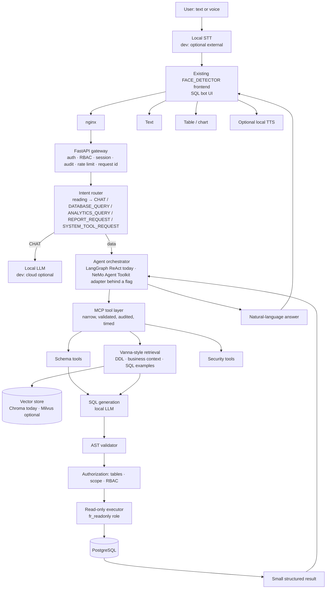
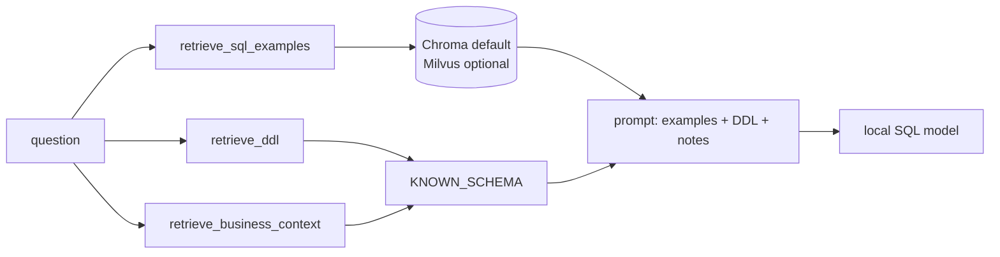

# 96 — Local Enterprise Data Agent: architecture, impact map, dev/prod modes

This document is the design and operations reference for upgrading the
FACE_DETECTOR SQL Bot into a local, MCP-based conversational data agent that
runs **online in development** and **fully air-gapped in production**. It
was written from an inspection of the repository first; every "reuse" claim
below points at code that exists today.

Companion documents: `97_DATA_AGENT_CONFIGURATION_GUIDE.md` (setting-by-setting
configuration for both modes), `90_AGENT_ARCHITECTURE.md` (the reasoning loop in
detail), `93_PRODUCTION_RUNBOOK.md`, `95_AGENT_PRODUCTION_ACCEPTANCE.md`,
`74_SECURITY_CHECKLIST.md`, `60_BACKUP_AND_RESTORE.md`.

---

## 1. Inspection: what exists today

| Concern | Where it lives | State |
|---|---|---|
| SQL bot UI (chat, history, sessions, PDF/Word export) | `frontend/` (`conversations.js`, `tracking.js`, `tracking-people.html`), `sql_agent/api/routes.py` | Working. REST `/query`, SSE `/query/stream`, WebSocket, history, memory, artifacts. |
| Reasoning loop (ReAct: plan → tool → observe → replan) | `sql_agent/graph.py`, `sql_agent/tools/agent_tools.py`, `agent_loop.py`, `reasoning.py` | Working LangGraph ReAct loop; the tool loop is bounded; Python holds authority over every model proposal. |
| Narrow internal tools (validated contracts) | `sql_agent/tools/tool_registry.py`, `contracts.py`, `tool_executors.py` | 11 tools. No `execute_any_sql` exists. |
| Turn reading (intent) | `sql_agent/tools/interpreter.py` | One model reading per turn into a typed structure (`wants`, `shape`, `format`), validated in Python. This *is* the intent router; it lacked the five named labels and a metric. |
| SQL guard | `sql_agent/security/sql_guard.py` | AST (sqlglot) policy: SELECT-only, table allow-list, subquery depth, function policy, per-user camera scope rewritten into the statement, LIMIT injection, `canonical` unscoped SQL. |
| Read-only execution | `sql_agent/database.py`, `SQL_AGENT_DB_USER` (`fr_readonly` role), guard rule `SQL_AGENT_DB_ROLE_SHARED` | Dedicated SELECT-only role; production boot refuses a shared role. |
| Knowledge base (Vanna-style retrieval) | `sql_agent/knowledge_base.py` (ChromaDB), `seed_catalog.py`, `seed_catalog_generated.py` | ~1070 verified question→SQL seeds; learning from conversations is off. Embeddings: Chroma's local ONNX MiniLM. |
| LLM provider abstraction | `sql_agent/llm/base.py`, `registry.py`, `gateway.py`, `ollama_provider.py`, `nim_provider.py` | Ollama (local) in every mode; NVIDIA hosted NIM only when `LLM_DEV_PROVIDER=nim` **and not production**. |
| Fail-closed production config guard | `backend/security/config_guard.py` | Refuses in production: hosted LLM provider, NIM API key, Opik tracer, shared DB role, weak secrets. Rules take explicit `env=`/probes, never `os.environ`. |
| Auth / RBAC / scope | `backend/auth/*`, `user_pipeline_access`, `_pipeline_scope_for` | The agent's SQL is rewritten to the caller's cameras; admins unrestricted. |
| Audit | `backend.auth.auth_security.audit()`, `sql_agent/services/user_query_history_service.py` | Reused as is; the agent turn gained a dedicated audit event. |
| Metrics / dashboards | `backend/core/metrics.py`, `sql_agent/observability.py`, `monitoring/` | Local Prometheus + Grafana in both compose files. |
| Tracing | `sql_agent/tracing.py` (Opik, development only) | No OpenTelemetry today. |
| Docker | `docker/docker-compose.cpu.yml` (dev), `docker-compose.prod.yml` + `prod.gpu.yml` | Prod networks `edge` / `data` (internal) / `ai` / `monitoring` (internal); only nginx publishes 80/443 (Grafana 3000). |
| Voice | — | **No STT/TTS path exists for the SQL bot.** "Voice" in this repo is speaker identification, not speech-to-text. The voice workflow is an addition behind an interface, not a reuse. |
| Milvus / Vanna / NeMo Agent Toolkit / MCP server | — | Not present before this work. |

## 2. Target architecture



The flow is preserved end to end: **existing SQL bot → intent router →
agent → MCP tools → retrieval → SQL generation → guard → read-only database
→ answer → existing UI**. The change makes the seams explicit; the loop is
not rewritten.

## 3. Impact map

### Reused as is
Frontend SQL bot and its REST/SSE/WebSocket contracts; authentication, RBAC,
per-user camera scope, request ids, rate limiting; the AST guard and the
read-only role; Prometheus, Grafana, Redis, PostgreSQL, network segmentation;
the audit function and the query-history rows.

### Added
| Addition | File(s) |
|---|---|
| Deployment-mode settings (`OFFLINE_MODE`, `LLM_PROVIDER`, `LLM_BASE_URL`, `LLM_MODEL`, `LLM_SQL_MODEL`, `LLM_API_KEY[_FILE]`, `EMBEDDING_PROVIDER`, `EMBEDDING_BASE_URL`, `EMBEDDING_MODEL_PATH`, `VECTOR_STORE`, `MILVUS_URI`, `MCP_SQL_URL`, `AGENT_ORCHESTRATOR`, `STT_PROVIDER`, `STT_BASE_URL`, `STT_MODEL_PATH`, `OTEL_EXPORTER_ENDPOINT`, `OFFLINE_BUNDLE_MANIFEST`, `OFFLINE_ALLOWED_HOSTS`, `ALLOW_EXTERNAL_APIS`, `ALLOW_MODEL_DOWNLOADS`, `ALLOW_EXTERNAL_TELEMETRY`) | `config.py`, `sql_agent/config.py` |
| Offline policy: internal-host test, known public hosts, violation collection, startup checklist | `backend/security/offline_policy.py`, wired into `config_guard.collect_violations` |
| Readiness + admin checklist | `backend/routes/health.py` (`/health/ready` component `offline_policy`; `/api/health/offline-policy` and `/health/offline-policy` admin-only), nginx locations |
| Intent labels, question hash, table extraction, turn facts | `sql_agent/intent.py` |
| Turn audit event + intent metric | `sql_agent/api/routes.py` (`finalize_turn`), `sql_agent/agent.py` (`last_turn_facts`) |
| Latency and failure metrics | `sql_agent/observability.py`, wired in `llm/gateway.py`, `tools/agent_tools.py` |
| Local OpenAI-compatible provider (vLLM / local NIM) | `sql_agent/llm/openai_compat_provider.py`, `registry.py`, `llm/__init__.py` |
| Vector-store factory (Chroma default, Milvus optional) | `sql_agent/vector_store.py`, `knowledge_base.py` |
| MCP tool catalogue and server | `sql_agent/mcp/tools.py`, `sql_agent/mcp/server.py` |
| Orchestrator selection and NeMo adapter | `sql_agent/orchestration/nemo_adapter.py`, `agent.py` |
| Offline bundle tooling | `scripts/offline_bundle.py`, `prepare_offline_bundle.sh`, `verify_offline_bundle.sh`, `import_offline_bundle.sh`, `docker/offline_bundle.spec.example.json` |
| Compose profiles `vllm`, `mcp-sql`, `milvus` and library offline switches | `docker/docker-compose.prod.yml` |
| Environment templates | `.env.example` (development block), `docker/env.production.example` |
| Deployment script | `deploy.sh` stage 06b (production offline policy: refuses dev-only/external settings, writes the missing mode keys, never starts Opik), `scripts/deploy/stage-dev.sh` stage D4b (starts self-hosted Opik in development only) |
| Admin settings page | `backend/routes/settings.py` category `deployment`, `backend/core/runtime_settings.py` metadata, policy keys added to `SECURITY_CRITICAL_KEYS` (read-only) |
| Tests | `tests/test_offline_policy.py`, `test_intent_router.py`, `test_mcp_tools.py`, `test_orchestrator_adapter.py`, `test_llm_provider_selection.py`, `test_offline_bundle.py`, `test_degradation_modes.py` |

### Refactored (small, behaviour-preserving)
`registry.py` registers the local OpenAI-compatible models when configured
(Ollama stays the default); `knowledge_base.py` opens its collection through
the factory (the Chroma path is unchanged); `observability.py` gained
histograms.

### Risks
- **Embedding download.** Chroma's default embedding fetches the MiniLM ONNX
  model on first use. Production ships it in the bundle; the checklist
  verifies `EMBEDDING_MODEL_PATH` exists and the boot fails otherwise.
- **Optional dependencies.** NeMo Agent Toolkit, pymilvus and the `mcp` SDK are
  optional imports behind flags; nothing existing depends on them, and a
  requested-but-absent toolkit falls back to LangGraph with a logged reason.
- **Latency.** The hosted 11B reader used in development is not the production
  model; the acceptance battery must be rerun on the production stack.
- **Voice.** No STT exists today; the interface (`STT_PROVIDER`, `STT_BASE_URL`,
  `STT_MODEL_PATH`) and the bundle item are defined, the model is a deployment choice.

## 4. Development vs production

| Component | DEVELOPMENT | PRODUCTION |
|---|---|---|
| Internet | Allowed | Forbidden (`OFFLINE_MODE=true`, enforced at boot) |
| LLM | Cloud (NVIDIA hosted) or local (Ollama, vLLM, NIM) | Local only (Ollama, vLLM or local NIM) |
| Embeddings | Local (Chroma ONNX) or configured | Local only, artifact verified |
| Model download | Allowed | Forbidden |
| MCP | In-process / internal | In-process / internal only |
| Vector store | Chroma (Milvus optional) | Chroma or Milvus, local |
| Database | Dev PostgreSQL | Internal PostgreSQL, `fr_readonly` for generated SQL |
| STT | Optional external or local | Local only |
| Telemetry | Opik optional (dev only) | Local Prometheus/Grafana; OTLP only to a local collector |
| Frontend CDN | Allowed if needed | Forbidden (assets vendored under `frontend/vendor`) |
| Package install | Online | Offline wheels from the bundle |
| Docker pulls | Allowed | Forbidden at runtime (images imported from the bundle) |

## 5. Intent routing

The reading (`interpreter.py`) and the committed action are the facts; the
label is derived, never re-guessed from words (`sql_agent/intent.py`):

| Reading / action | Label |
|---|---|
| `wants=chat` or `recall`, no data action | `CHAT` |
| data action, `shape=report` or `answer` | `DATABASE_QUERY` |
| data action, `shape=summary` (count, ranking, comparison, share, trend) | `ANALYTICS_QUERY` |
| document/translation action, or a named `format` | `REPORT_REQUEST` |
| only `list_cameras` / `get_task_state` / `list_my_documents` / `update_task_state` | `SYSTEM_TOOL_REQUEST` |

Observable as `fr_agent_intent_total{intent}` and in every
`sql_agent_turn` audit line; testable in `tests/test_intent_router.py`.

## 6. MCP tools

All tools live in `sql_agent/mcp/tools.py` (`MCPToolset`). Each has a
Pydantic input model (unknown fields refused), an output model, a timeout,
a metric (`fr_agent_stage_duration_seconds{stage="mcp_call",component}`),
and one audit line (tool, outcome, duration, request id, user id; never
arguments, rows or SQL text). Every call returns
`{status, tool, version, data, error_code, error}` with `error_code` ∈
`INVALID_ARGUMENTS | INVALID_RESULT | TIMEOUT | DEPENDENCY_UNAVAILABLE |
PERMISSION_DENIED | NOT_SUPPORTED | INTERNAL`. Exceptions never escape and
never carry a DSN or a secret.

| Group | Tools | Backed by |
|---|---|---|
| Schema | `database.search_schema`, `database.describe_table`, `database.get_relationships`, `database.list_allowed_tables` | `DatabaseManager.KNOWN_SCHEMA`, the SQL policy allow-list |
| Vanna | `vanna.retrieve_sql_examples`, `vanna.retrieve_ddl`, `vanna.retrieve_business_context` | the knowledge base (Chroma/Milvus), DDL rendered from the known schema, the relationship notes |
| SQL | `sql.generate`, `sql.explain`, `sql.validate` | the deployment's generator (the graph's generation node), sqlglot, the AST guard |
| Security | `security.authorize_query`, `security.enforce_readonly`, `security.check_allowed_tables`, `security.apply_limits` | `sql_guard.validate_sql` with the caller's camera scope |
| Database | `database.execute_readonly`, `database.explain_query`, `database.cancel_query` | `DatabaseManager.execute_query` (guard + scope + `fr_readonly`), EXPLAIN only when the policy allows it, the API layer's canceller |
| Analytics | `analytics.aggregate`, `analytics.compare`, `analytics.trend`, `analytics.percentage_change` | pure Python over rows |
| Reporting | `report.generate_csv`, `report.generate_pdf`, `report.generate_excel` | csv, the existing `export_builders.build_pdf_bytes`, openpyxl |
| System | `system.health`, `system.capabilities` | database probe, knowledge-base count, providers, offline mode |

There is no `execute_any_sql`. `database.execute_readonly` refuses before
the database sees anything when the verdict is not `allowed`
(`tests/test_mcp_tools.py::test_execute_readonly_refuses_before_the_database_sees_anything`).

**The catalogue is the tool path for every orchestrator (2026-09-06).** The
LangGraph loop's `retrieve_examples` node calls `vanna.retrieve_sql_examples`
and its `execute_sql` node calls `database.execute_readonly`
(`SQLAgentTools.catalogue`, `tests/test_loop_uses_mcp_catalogue.py`); the
NeMo adapter uses the same catalogue. A refused statement carries the
guard's own code through the envelope (`detail.error_code`), so the loop's
security enforcement still distinguishes a parse error from a `DELETE`.

**Tracing.** In development every tool call is an Opik span named
`mcp:<tool>` (type `tool`, arguments and envelope captured) nested in the
turn's trace (`tracing.tool_tracker`); in production nothing is attached.
Every call also writes an `event=mcp_tool_call` audit line.

**Status.** The `mcp` SDK 2.1 is in the image requirements; the protocol
server was exercised over streamable HTTP on `127.0.0.1:9901/mcp` with the
SDK client: 26 tools listed, a SELECT executed through the gate, a DELETE
refused. MCP tool names use `_` for `.` (`database_execute_readonly`); the
catalogue name is in each description.

Serving over MCP: `python -m sql_agent.mcp.server` (stdio) or `--http` on
`127.0.0.1:9901`; a non-internal bind address is refused (exit 78). The
`mcp-sql` compose profile runs it on the internal `ai`/`data` networks only.

## 7. Vanna architecture

Vanna is the *pattern*: DDL, business documentation and verified
question→SQL examples, retrieved semantically so the model sees only what is
relevant. The knowledge base already does this with ~1070 verified seeds
(`seed_catalog.py`, `seed_catalog_generated.py`); the MCP `vanna.*` tools expose
the three retrievals, and the vector store is selectable:



Embeddings are computed locally in both stores (Chroma's ONNX MiniLM);
Milvus stores vectors and never embeds. Learning from conversations is off
(`SQL_AGENT_LEARN_FROM_QUERIES=false`): only verified examples enter the
store. A retrieved verified example at ≥ 0.9 similarity is reproduced, not
rewritten; the message is also retrieved with stored names swapped for the
seed placeholders so the shape matches regardless of the name.

## 8. SQL security gate

```
model output → parse (sqlglot) → AST policy: statement type SELECT/UNION only,
tables ⊆ allow-list, join/subquery limits, function policy → per-user camera
scope rewritten INTO the statement → LIMIT enforced → statement timeout →
fr_readonly role (SELECT-only at the database) → execution
```

Refused by the AST, not by regex: INSERT, UPDATE, DELETE, DROP, ALTER,
TRUNCATE, CREATE, MERGE, REPLACE, GRANT, REVOKE, EXECUTE, stacked
statements, unknown tables (a hallucinated table is `TABLE_NOT_ALLOWED`),
malformed SQL. The database role is the last line: production refuses a
boot where the agent shares the application's role. Nothing depends on
prompting the model to behave.

## 9. Local model deployment

| Provider | Setting | Notes |
|---|---|---|
| Ollama (default) | `LLM_PROVIDER=ollama`, `OLLAMA_BASE_URL`, `OLLAMA_MODEL`, `OLLAMA_SQL_MODEL`, `OLLAMA_INTERPRETER_MODEL` | model files in the `ollama_models` volume (bundle kind `llm`) |
| vLLM | `LLM_PROVIDER=vllm`, `LLM_BASE_URL=http://vllm:8000/v1`, `LLM_MODEL`, `LLM_SQL_MODEL` | `--profile vllm`; weights under the `vllm_models` volume; `VLLM_MODEL` names the path |
| Local NIM | `LLM_PROVIDER=nim_local`, `LLM_BASE_URL=http://nim:8000/v1`, `LLM_MODEL`, optional `LLM_API_KEY_FILE` | same OpenAI-compatible client |
| NVIDIA hosted (development only) | `LLM_DEV_PROVIDER=nim`, `NVIDIA_NIM_*` | refused by the guard and the offline policy in production |

**NeMo Agent Toolkit (`AGENT_ORCHESTRATOR=nemo`).** Verified on
2026-09-06 with nvidia-nat 1.8.0 (LangChain plugin): the toolkit's ReAct
agent, bound to five catalogue tools, retrieved verified examples, executed
through `database.execute_readonly` and answered "MAD5AL AMEN (1) with 50
detections" (correct) in 108 s on the development model. Native tool
calling needs a client with `bind_tools` (Ollama has it; the NIM client
falls back to text ReAct). **numpy.** `nvidia-nat-core` requires
`numpy~=2.3`; the image used to pin `numpy==1.26.4` for OpenCV 4.9, whose
wheels were built against numpy 1 (installing the toolkit on top replaced
numpy and broke OpenCV). Fixed on 2026-09-06 by moving the image to
`numpy>=2.3,<3` with `opencv-python-headless==4.10.0.84`
(`requirements-base.txt`, `requirements-ml.txt`): a probe container from
the dev image confirmed the SCRFD detector, ArcFace recognizer, FAISS and
every other ML library run on numpy 2.4, and the toolkit then installs with
a clean `pip check`. Rebuild the image after the change; the toolkit itself
stays optional (`requirements-agent.txt`).

Selection is by capability, not by name: the registry routes SQL tasks to
the SQL specialist and chat/reading tasks to the general model; a local
OpenAI-compatible server is registered with `RESTRICTED` sensitivity and
preferred over Ollama when configured. Any Qwen, Nemotron, Llama or Mistral
family model that serves the OpenAI chat API works unchanged.

## 10. Offline model import (bundle)

```
online machine                                   air-gapped host
--------------                                   ---------------
scripts/prepare_offline_bundle.sh spec out/  →   scripts/verify_offline_bundle.sh bundle/
  (models, tokenizer, embedding ONNX, STT,        scripts/import_offline_bundle.sh bundle/
   docker images, wheels, frontend/vendor,          (docker load, files to dest paths)
   drivers, certs, config; manifest.json           OFFLINE_BUNDLE_MANIFEST=<bundle>/manifest.json
   with SHA-256 per file; sbom.json)               docker compose ... up -d
```

`docker/offline_bundle.spec.example.json` is a starting spec. `verify`
prints every mismatch and exits non-zero; `import` refuses a bundle that
does not verify. At boot, `OFFLINE_BUNDLE_MANIFEST` (when set) must exist,
and `EMBEDDING_MODEL_PATH`, `DETECTION_MODEL`, `RECOGNITION_MODEL` (and
`STT_MODEL_PATH` when STT is on) must exist.

## 11. Offline Docker image import

Images are bundle items of kind `image` (`docker save`); `import` runs
`docker load`. Production compose never pulls: every image referenced by
`docker-compose.prod.yml` (and the optional profiles) must be in the bundle.
`FACE_RECOGNITION_IMAGE` names the application image the `mcp-sql` profile
reuses.

## 12. Configuration

Development (`.env.example`, "Deployment mode" block): `OFFLINE_MODE=false`,
`LLM_PROVIDER=ollama|vllm|nim_local|nvidia_cloud`, `ALLOW_EXTERNAL_APIS=true`,
`ALLOW_MODEL_DOWNLOADS=true`. Production (`docker/env.production.example`):
`ENVIRONMENT=production`, `OFFLINE_MODE=true`, local providers only, every
`ALLOW_*` false, `HF_HUB_OFFLINE=1`, `TRANSFORMERS_OFFLINE=1`. Secrets are
Docker secrets (`*_FILE` settings), never committed.

What the guard refuses in production (exit 78, every violation listed at
once): `OFFLINE_MODE=false`; any external endpoint in `LLM_BASE_URL`,
`OLLAMA_BASE_URL`, `EMBEDDING_BASE_URL`, `MCP_SQL_URL`, `MILVUS_URI`,
`STT_BASE_URL`, `OTEL_EXPORTER_ENDPOINT`, `OPIK_URL_OVERRIDE`; a cloud
`LLM_PROVIDER`; `LLM_DEV_PROVIDER`; a non-local `EMBEDDING_PROVIDER` or
`STT_PROVIDER`; the Opik tracer; any `ALLOW_*` flag; a missing artifact or
manifest. Warnings (not fatal): a cloud credential present, a library
offline switch unset.

Example refusal:

```
PRODUCTION OFFLINE POLICY VIOLATION: external LLM endpoint detected: https://integrate.api.nvidia.com/v1
  key: LLM_BASE_URL   fix: Point LLM_BASE_URL at an internal service ...
Production startup aborted.
```

## 13. Network isolation

Production networks (`docker-compose.prod.yml`): `edge` (nginx ↔ API),
`data` (`internal: true`: postgres, redis, migrate, backup, milvus/etcd/minio),
`ai` (API ↔ ollama / vllm / mcp-sql), `monitoring` (`internal: true`). Only
nginx publishes 80/443 (Grafana publishes 3000 as before). The database,
Redis, Milvus, MCP and the LLM servers are `expose`d, never `ports`.
`docker compose config` with the three profiles enabled lists no new
published port (verified 2026-09-06).

## 14. Troubleshooting

| Symptom | Where to look | Cause |
|---|---|---|
| API exits 78 at boot | container log, `unsafe production configuration` report | an offline-policy or guard violation; every code is listed with its fix |
| `/health/ready` is `not_ready` with `offline_policy.healthy=false` | `GET /health/offline-policy` (admin) | the `[FAIL]` lines name the setting or artifact |
| "OFFLINE_ARTIFACT_MISSING EMBEDDING_MODEL_PATH" | the Chroma ONNX cache volume | the bundle was not imported, or the path differs |
| answers say "I could not build a query" | Opik trace (dev) or the audit line's `generated_sql_hash`/`status` | the SQL model could not produce an accepted statement; add a verified seed |
| a tool returns `DEPENDENCY_UNAVAILABLE` | `fr_agent_stage_errors_total{stage="mcp_call"}` | database, vector store or generator down; the message never carries the DSN |
| `orchestrator=langgraph (nemo requested ...)` in the log | `AGENT_ORCHESTRATOR=nemo` without the toolkit | install the toolkit wheel from the bundle or keep LangGraph |

## 15. Backup / recovery

Unchanged: `60_BACKUP_AND_RESTORE.md` covers PostgreSQL and storage. New
state to include: the Chroma directory (`CHROMADB_PATH`) — recreatable from
code (seeds re-load from the hash) but it also holds the audited learned
examples; the Milvus volumes when that profile is used; the offline bundle
itself (keep the verified copy with its manifest).

## 16. Monitoring

Prometheus (local) scrapes the API. New series:

| Metric | Labels | Meaning |
|---|---|---|
| `fr_agent_intent_total` | intent | routed intents |
| `fr_agent_stage_duration_seconds` | stage ∈ request, llm, vanna_retrieval, sql_generation, sql_validation, db_query, mcp_call, voice_stt, response_generation; outcome; component | per-stage latency (llm_latency, vanna_retrieval_latency, sql_generation_latency, db_query_latency, mcp_call_latency, voice_stt_latency) |
| `fr_agent_stage_errors_total` | stage, outcome | llm_errors, mcp_errors, db_query_errors |
| `fr_agent_sql_validation_failures_total` | code | statements the guard refused |
| `fr_agent_rows_returned` | — | rows per executed query |
| `fr_agent_db_timeouts_total` | — | statement timeouts |

Existing: `fr_agent_run_duration_seconds`, planner/event counters, GPU
metrics from the NVIDIA stack. Grafana dashboards live in `monitoring/`.
Tracing: Opik in development only; an OTLP collector may be configured
with `OTEL_EXPORTER_ENDPOINT` pointing at a local address (external
addresses are refused).

## 17. Auditing

Each turn writes one `[AUTH_AUDIT] event=sql_agent_turn` line: request id,
user id, role, duration, question hash, intent, tools, tables,
generated-SQL hash, validated-SQL hash, authorization decision, row count,
model, status, and the history row id. The history row's metadata carries
the SQL itself (durable, access-controlled), so logs never contain SQL,
questions, names, credentials, tokens or rows. Each MCP call writes
`event=mcp_tool_call` with tool, outcome and duration.

## 18. Production validation checklist

```
[PASS] offline mode                                   OFFLINE_MODE=true
[PASS] no external inference endpoint configured
[PASS] no external telemetry endpoint configured
[PASS] MCP and vector store internal
[PASS] STT local
[PASS] no model download permitted
[PASS] required model artifacts found
[PASS] offline policy validated
[PASS] PostgreSQL reachable
[PASS] local LLM reachable
[PASS] MCP reachable            (when MCP_SQL_URL is set)
[PASS] Milvus reachable         (when VECTOR_STORE=milvus)
[PASS] STT reachable            (when STT_BASE_URL is set)
```

Read it with `GET /api/health/offline-policy` (JSON, machine clients) or
`GET /health/offline-policy` (browser) as an administrator, or run the
guard directly: `python -c "from backend.security.config_guard import enforce; enforce()"`
inside the container. Before go-live also: `scripts/verify_offline_bundle.sh`,
`tests/test_offline_policy.py`, `tests/test_mcp_tools.py`,
`tests/test_degradation_modes.py`, the acceptance battery of
`95_AGENT_PRODUCTION_ACCEPTANCE.md` on the production stack, and a run with
the gateway physically disconnected.

## Production readiness proof (2026-09-06)

What was executed, not reasoned about, before declaring the production path ready:

| Gate | Command | Result |
|---|---|---|
| deploy script logic | `./deploy.sh --self-test` | 64 passed |
| shell syntax | `bash -n deploy.sh scripts/deploy/*.sh scripts/*.sh` | clean |
| production compose | `docker compose --env-file docker/env.production.example -f docker/docker-compose.prod.yml -f docker/docker-compose.prod.gpu.yml config` with the secret variables stubbed, default and `vllm,mcp-sql,milvus` profiles | valid |
| nginx | `nginx -t` on `nginx.prod.conf` with the internal certificates (`--add-host face_recognition:127.0.0.1 --add-host martin:127.0.0.1`) | ok |
| config guard, production environment | `python -m backend.security.config_guard` inside a throwaway API container carrying the rendered `face_recognition` environment, Docker-style 0400 secrets, the weights and the embedding cache | exit 0 |
| config guard, copied development environment | same, plus `LLM_DEV_PROVIDER=nim`, `SQL_AGENT_OPIK_ENABLED=true`, `LLM_PROVIDER=nvidia_cloud` | exit 78 with five named violations |
| tests | offline policy, config guard, provider selection, bundle, MCP catalogue, degradation, orchestrator, intent, runtime editability | 222 passed |

Two defects surfaced only because the guard was run against the real rendered environment:

1. The guard derived its model-file probe from the storage (directory-writability) probe, so a correct production boot reported `DETECTION_MODEL`, `RECOGNITION_MODEL` and `EMBEDDING_MODEL_PATH` as missing and exited 78. `default_artifact_probe` (a file probe) is now wired explicitly in `enforce()` and `main()`; `tests/test_offline_policy.py` pins it.
2. `docker-compose.prod.yml` did not forward the deployment keys from `docker/.env`, so `env.production.example` documented lines that never reached the container (and named Ollama models that do not exist). The API service now forwards them with their offline defaults; the dev-only keys are deliberately not forwarded (section 5.4 of `Docs/97`).

Still to run on the production host itself: the GPU image build (`Dockerfile.gpu` with numpy 2 and onnxruntime-gpu 1.20.2 has not been built here), `./deploy.sh validate`, and the SQL-agent acceptance battery against the Ollama models.
