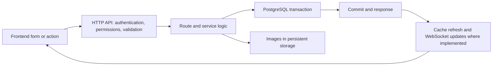

# Frontend, API, and database audit — 21 September 2026

The main workflows pass their acceptance checks and production data is structurally consistent. The system is **not fully clear of defects**: this audit reproduced a commit-error handling problem, a date-filter/card mismatch, an identity-list/access inconsistency, an incorrect connection metric, and a missing frontend asset. No application fixes were applied during this audit.

## Follow-up fixes — deployed 21 September 2026

All five application findings above have targeted fixes. Failed final commits now finish before the HTTP response and propagate as errors; session counters decrement once; filtered cards use matching camera events; embedding/detection-only identities remain listed with an explicit “No recorded sighting” label and camera-access filtering; the missing footer include was removed. The stale migration test was also corrected and restores the current schema head after cleanup.

Validation after these changes: **82 integration tests passed (1 skipped)**, including the previously failing identity-membership checks and the full API sweep; **32 frontend tests passed**; **59 database-integrity tests passed** without excluding the migration test. The small unit batch for commit/session errors and camera counts passed **7 tests**. The API sweep still completed **536 calls without a server error** (expected permission/validation errors remain covered separately). The commit-error regression explicitly expects an HTTP 500.

The token-generation utility's direct database-session call was adjusted to match the dependency change. No database migration or production data repair is needed. The API and ML worker were deployed from targeted images after verified backup `/backups/20260921T073824Z`. Both services are healthy; deployed file hashes match the tested source. Live read-only checks verified both pipeline totals and date-filtered events for 20 identities. HTTPS health returns 200. Rollback images are retained. The sections below retain the original audit findings as historical evidence.

## Scope and method

Reviewed the VAS frontend, its backend routes and services, and the production PostgreSQL/storage relationships. The separately deployed LAF-AI chatbot application was not subjected to a full source or conversation audit here; this report concerns the VAS repository, including its chatbot integration endpoints.

- Inventoried 40 first-party JavaScript files, 235 local HTML asset references, 240 literal API references, and 308 route declarations in backend/SQL-agent source. These counts describe the scan, not 308 independently proven workflows. URL fragments assembled at runtime were reviewed separately.
- Ran the existing API acceptance sweep on an isolated stack: **536 HTTP calls, no 5xx responses**. The calls include successful writes checked against database rows, malformed requests, permission failures, and declared GET/write-route sweeps. Expected 4xx responses were part of validation and authorization tests.
- Ran frontend, page, authorization, storage, and database tests on temporary resources. The production checks used read-only transactions and filesystem existence checks.
- All temporary database/test-stack containers were removed. Production API and Ollama remained healthy at the final check.

This was not an exhaustive browser interaction test. JavaScript tests use targeted harnesses and the page suite includes source/API contracts. Dragging, responsive layout, every possible click sequence, concurrent-user load, and external email/SMS delivery were not verified in a real browser or against external recipients. Read-only production checks cannot prove every historical write succeeded.

## Findings

### 1. High priority: final commit failures can be reported as successful saves

**Location:** [db_connection.py](../db_connection.py#L133), especially the connection-closed exception branch around lines 136–150.

The shared `get_session()` context manager attempts the final transaction commit. When SQLAlchemy raises an `InterfaceError`/`DisconnectionError` containing “connection is closed,” it logs a warning and suppresses the exception. It neither establishes whether the database committed nor tells the caller that the outcome is uncertain.

**Reproduction:** a minimal FastAPI endpoint using the real `get_db` dependency and a mocked session whose commit raises `InterfaceError` returned HTTP **200** and `{"saved": true}`. Rollback was not attempted. This demonstrates a failure-handling defect; it does not establish that production has already lost data. Routes that explicitly commit inside their service may encounter the error before this final-commit handler, so the impact is not identical for every write.

**Recommended correction:** propagate commit failures, attempt rollback where possible, and ensure the HTTP success path follows confirmed persistence. Do not retry non-idempotent writes automatically when the commit outcome is unknown.

Evidence: `logs/frontend-api-audit-20260921/commit-http.txt`, `session-errors.txt`, and their reproduction scripts.

### 2. Medium priority: a date-filtered identity card can show a sighting outside the selected dates

**Locations:** [identities.py](../backend/routes/identities.py#L912), [appearance_events.py](../backend/core/appearance_events.py#L25), [admin-unknown.js](../frontend/js/admin-unknown.js#L788).

The listing filters identities using appearances inside the requested time range. It subsequently fetches `latest_camera_events` without passing that time range. The frontend displays that event's timestamp and snapshot on the card.

**Reproduction:** one synthetic identity had sightings on January 1 and January 3. A request for January 1, with an exclusive January 2 upper bound, returned a card event timestamp of **January 3 at 12:00 UTC**. The identity matches the filter, but the displayed sighting does not. The same selection logic can select a snapshot from outside the requested period.

**Recommended correction:** apply the requested event window to the camera-event lookup used to render filtered cards. If latest-ever information is also desired, return it separately and label it explicitly.

Evidence: `logs/frontend-api-audit-20260921/date-window.txt`; reproduction used synthetic records in a disposable schema-only database.

### 3. Medium priority: listing and identity-access rules disagree for records without appearances

**Locations:** [identities.py](../backend/routes/identities.py#L923), [identity_pipelines.py](../backend/core/identity_pipelines.py#L1), and the frontend's requirement for `camera_events`.

The effective-pipeline/access logic supports three evidence sources in priority order: appearances, otherwise embeddings, otherwise faces joined to detections. The unknown listing additionally requires an appearance to exist, even with `show_all=true`. Consequently an identity can be accessible by its camera evidence yet absent from the unknown list.

**Evidence:** four failing assertions across `test_unknown_filters.py` and `test_identity_pipeline_authority.py`, covering embedding-only and face/detection-only records and administrator visibility. These were the only failures in the first acceptance batch.

**Production impact checked:** **0 of 24 active unknown identities** currently has embedding/detection evidence without appearances. The inconsistency is reproducible, but this scan did not find an affected active unknown in production.

**Recommended correction:** decide and enforce one supported rule. If fallback evidence remains supported, provide an explicit rendering path for those identities. If appearance records are mandatory, align authorization, migration/repair behavior, and tests; do not silently discard supported records.

### 4. Low priority: active database session counts can become negative

**Location:** [db_connection.py](../db_connection.py#L201), together with the outer exception handlers around lines 209–233.

The inner `finally` decrements `active_sessions`; the outer exception handlers decrement it again. A single context raising `HTTPException` left the counter at **-1** in the isolated reproduction. This makes operational statistics misleading. It is not evidence of an actual leaked connection.

**Recommended correction:** decrement once per acquired session, at one cleanup point.

Evidence: `logs/frontend-api-audit-20260921/session-errors.txt`.

### 5. Low priority: Background Tasks requests a nonexistent script

**Location:** [background-tasks.html](../frontend/admin/background-tasks.html#L283).

The active `/admin/background-tasks` page references `/frontend/js/footer-loader.js`, which does not exist. Production returns **404** for that asset. The page's main tasks script exists; this finding alone does not imply that task operations fail.

**Recommended correction:** remove the obsolete include or supply the intended footer implementation.

Evidence: `logs/frontend-api-audit-20260921/frontend-assets.json`; 234 of 235 checked local asset references resolved.

## How the main data flows work

The diagram is a general flow, not a claim that image files and SQL writes share an atomic transaction. They do not; enrollment/storage services implement cleanup and ordering separately.

| Workflow | Frontend → API/service | Persistence and evidence checked |
|---|---|---|
| Sign-in, user administration, permissions | `signin.js`, `admin-users.js` → auth/users and user service | User CRUD, password changes, access records, deletion/audit preservation, invalid input and unauthorized calls |
| Pipeline rename/location | `admin-pipelines.js` → pipeline endpoints in `users.py` | Coordinates, aliases, camera relations, and alert restrictions |
| Add person / add photo | `upload-modal.js`, `admin-known.js` → upload/enrollment services | Identity, image and embedding rows, confirmation/cancel behavior, UUID-based image storage |
| Unknown identity browsing | `admin-unknown.js` → unknown listing and camera events | Pagination and filtering; two inconsistencies above remain |
| Identity profile | `admin-identity.js` → identity details/images | API/page contracts and stored photo references |
| Watchlists | `admin-watchlists.js` → watchlists/watchlist service | Create, edit, entry membership, deletion/restore, permissions and persistence |
| Live alerts / inbox | `admin-live-alerts.js`, `detection-alert-inbox.js` → alert routes/services | Create/update/delete, trigger presentation, acknowledgements, snapshot access and validation |
| Search and history | `admin-search.js`, `admin-search-history.js` → search routes | Search/history contracts and authorization |
| Settings / background / ML pages | Corresponding admin scripts → settings/task/ML routes | Setting writes and audits, seed concurrency, page contracts, retention/background persistence |
| VAS conversations and chatbot handoff | Conversation UI and SSO/audit endpoints | Conversation lifecycle, SSO ticket handling, audit spoofing protection; not a full LAF-AI tool/session test |

## Production database and storage results

- Checked **101 foreign-key constraints**: **0 orphaned references**.
- **0 unvalidated constraints**, **0 invalid indexes**, and **0 other transactions older than five minutes** at the time of the query.
- Database migration revision: **`ff17b8c9d0e1`**.
- Stored image references checked: **3** distinct enrollment-image paths, **27** identity-thumbnail paths, **178** face-image paths, and **163** appearance-snapshot paths. **No missing files or invalid paths** were found. Paths can overlap between tables; these are per-table counts.
- No live records were created, renamed, deleted, or repaired by the production database checks.

## Test outcomes and limitations

| Batch | Result |
|---|---|
| JavaScript UI regression tests | **31 passed** |
| First-party JS syntax parsing, including modules | **40 files parsed, 0 syntax errors** |
| API acceptance / identity / alert / permission / upload batch | **128 passed, 4 failed, 7 skipped**; four failures are finding 3 |
| Page / auth / watchlist / camera-event / storage batch | **254 passed, 8 skipped** |
| Database integrity, background tasks, expiry and schema checks after isolating stale test | **58 passed, 1 deselected** |
| Additional controlled reproductions | Commit failure → HTTP 200; negative session counter; out-of-window card timestamp |

The initial schema-integrity run had **3 failures**. The first was a stale migration test: `test_migration_roundtrip_preserves_populated_rows_and_refuses_corruption` upgrades only to `fee5f6a7b8c9`, then queries using today's ORM, which expects the later `live_search_alerts.auto_name` column. Its failure leaves the disposable schema at that older revision, causing two subsequent failures. A fresh run excluding that single test passed all 58 remaining checks. This is a **test-maintenance issue**, not evidence that production lacks `auto_name`. Fix the test's historical-schema assertions and restore the original head in cleanup before relying on it for migration acceptance.

One disposable API worker stalled before application initialization; restarting that test container allowed the page suite to run. Production was unaffected. The startup stall was not diagnosed sufficiently to classify as an application defect.

## Evidence

Detailed artifacts are in `logs/frontend-api-audit-20260921/`: route inventory, JS/asset scans, production integrity/storage summaries, test logs, and small reproduction scripts. `logs/e2e-api-report.md` contains the 536-call sweep; its introductory “defects fixed” prose is historical fixture text, not fixes made by this audit.

Prioritize the final-commit error handling and filtered camera-event selection, then align identity membership rules. Address the session counter, missing footer asset, and stale migration test afterward.
