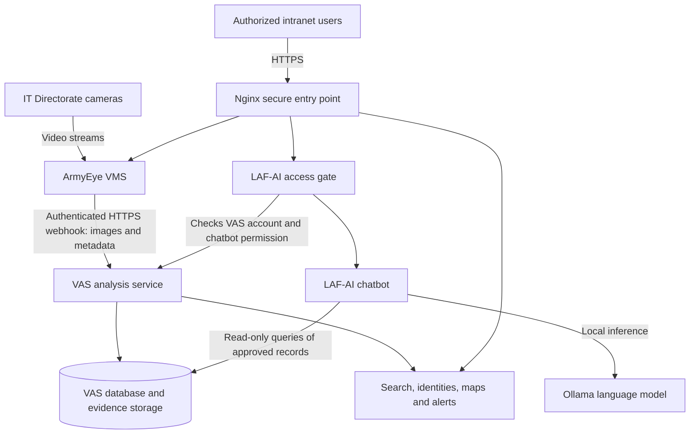

# VAS, ArmyEye VMS and LAF-AI — Implementation and Testing Overview

**Prepared for:** IT Directorate  
**Date:** 15 September 2026  
**Stage:** Installed deployment prepared for controlled camera testing; final operational deployment follows successful testing and acceptance.

## 1. Executive overview

The solution brings together three applications on an Ubuntu server to collect camera evidence, analyze it, and help authorized personnel understand the results.

| Application | Main purpose | Typical user activity |
| --- | --- | --- |
| **ArmyEye VMS** | Camera and video pipeline management | Connect cameras, preview streams, configure processing and publish detection evidence. |
| **VAS** | Visual analysis and investigation | Recognize faces, manage identities, search appearances, review alerts and investigate activity across cameras. |
| **LAF-AI chatbot** | Conversational assistance and data analysis | Ask questions about approved VAS records, summarize findings and produce analysis reports. |

**In simple terms: VMS supplies the camera evidence, VAS turns it into searchable records, and LAF-AI helps users understand those records.** Operators remain responsible for reviewing matches and interpreting findings.

The applications are already installed and have undergone service and selected integration checks. The next stage is a controlled trial using the IT Directorate's designated cameras. That trial must establish actual camera compatibility, recognition performance, alert behavior and usability before final operational approval.

## 2. How the applications work together

### A complete example

1. An operator connects a designated entrance camera to a VMS pipeline.
2. VMS reads the video and processes frames according to that pipeline's model, sampling and publisher settings.
3. The publisher sends configured image evidence and metadata to VAS. Camera/pipeline identifiers and event timestamps connect the evidence to its source.
4. VAS validates the request, detects faces, calculates face representations and compares them with stored identities.
5. VAS records the resulting detections and appearances. Depending on the evidence and configured thresholds, a face may match an existing identity or remain unknown.
6. Operators review the evidence in VAS. Applicable watchlist or live-search rules can generate alerts.
7. An authorized LAF-AI user asks, for example, “How many detections were recorded at the entrance today?”
8. In Data Mode, LAF-AI queries the permitted VAS records and explains the results, potentially with a table, chart or report.

A chatbot answer reflects the records that have reached VAS. It is not a direct observation of the camera's current video. A camera outage or processing backlog can therefore make the latest available information incomplete.

### Integration boundaries

| Connection | What it does |
| --- | --- |
| VMS → VAS | Sends configured detection evidence through an authenticated webhook over HTTPS. |
| VAS → its database/storage | Persists identities, appearances, detections and related analysis/evidence. |
| LAF-AI gate → VAS | Checks login, account status and permission to use the chatbot. |
| LAF-AI → VAS database | Reads an explicitly approved set of analytics tables and columns. |
| LAF-AI → Ollama | Uses locally installed language models to generate responses and tool requests. |

The reviewed integration does not establish direct chatbot control of VMS cameras or a direct LAF-AI connection to the VMS database. Camera operations belong in VMS; identity and alert administration belong in VAS.

## 3. VAS: how it works and its features

### Processing flow

1. **Receive evidence:** Accept authenticated webhook submissions containing image evidence and source metadata.
2. **Validate and process:** Check inputs and apply configured processing, quality and duplicate-handling rules.
3. **Detect faces:** Use the installed face-detection model to locate faces in the submitted image.
4. **Represent and compare:** Use a face-embedding model to produce a numerical representation of each face. Compare it with stored representations using vector similarity search.
5. **Record appearances:** Store identity associations, timestamps, camera references and supporting evidence.
6. **Analyze and notify:** Update searchable history and evaluate applicable alert or analytical rules.
7. **Support review:** Present results to operators for investigation, correction and follow-up.

The implementation uses a Python/FastAPI backend, browser-based administration pages, PostgreSQL with pgvector, Redis, and local face models using ONNX Runtime. GPU acceleration is part of the installed deployment. Dedicated background processing handles longer-running maintenance and ML work.

### Main features

| Feature | What it provides |
| --- | --- |
| **Known and unknown identities** | Separate review of recognized people and unidentified appearances. |
| **Enrollment and promotion** | Add reference photos and promote a reviewed unknown identity while preserving its appearance history. |
| **Identity lifecycle management** | Rename and manage profiles, review merge suggestions, merge duplicates and support unmerge workflows. |
| **Face-image search** | Search stored identities using a supplied face image, with camera and date filtering. Search does not itself enroll the person. |
| **Detection history** | Review recorded sightings with source cameras, timestamps and available images. |
| **Cross-camera tracking** | Reconstruct recorded appearances across multiple cameras and present timelines. |
| **Offline maps** | Display configured camera locations and recorded movement information using installed map data. |
| **Watchlists and live alerts** | Configure monitored identities or search criteria, camera restrictions and schedules; review resulting triggers. Notification delivery depends on configured destinations. |
| **Intelligence workspace** | Explore co-appearances, relationships, temporal activity and related analytical results. |
| **Risk and pattern analysis** | Review configured anomaly, pattern and assessment outputs. These are analytical signals requiring interpretation. |
| **Background jobs and ML operations** | Monitor processing jobs, maintenance, model-related workflows and failures. Some analytical functions need sufficient data or trained artifacts. |
| **Administration and accountability** | Manage users and permissions, review audit records and logs, inspect system health, configure retention and export supported records. |

Cross-camera associations depend on matching quality and camera coverage. Map paths connect recorded observations; they do not prove a person's exact route between cameras. Relationship or risk outputs describe detected patterns and do not independently establish intent or wrongdoing.

## 4. ArmyEye VMS: how it works and its features

### Processing flow

1. **Register a video source:** Configure the camera stream or supported test source.
2. **Create a pipeline:** Select the source, inference engine/model and processing parameters.
3. **Start processing:** VMS reads frames and runs the configured inference/tracking workflow.
4. **Preview and monitor:** Operators inspect output and processing status through the web interface.
5. **Publish evidence:** A result publisher sends the configured results, images and metadata to VAS.
6. **Operate the pipeline:** Operators can adjust settings, stop/start processing and investigate errors.

VMS is deployed separately from VAS, with its own application container and database. Its source is organized around inference nodes, inference engines, trackers and result publishers. This separation allows camera acquisition settings to be managed independently of VAS identity records.

### Main features

| Feature | What it provides |
| --- | --- |
| **Video sources** | Camera/video ingestion, including RTSP/IP camera workflows and supported local test sources. Actual camera compatibility must be tested. |
| **Pipeline builder** | Configure how a video source is processed and where its results are sent. |
| **Pipeline management** | Start, stop and monitor configured pipelines; available controls depend on the pipeline implementation. |
| **Live previews** | View pipeline output and inspect whether camera images and detections are usable. |
| **Model and engine configuration** | Select installed inference models and supported engines, including YOLO/ONNX pathways. Availability depends on the installed build and artifacts. |
| **Object detection and tracking** | Detect configured classes and track objects within video streams when supported by the selected engine. |
| **Result publishing** | Send selected images and detection metadata to downstream services; the VAS integration uses a webhook publisher. |
| **Operational monitoring** | Inspect logs, telemetry, node information and pipeline status. |
| **Node management and APIs** | Manage supported node/pipeline operations through the interface and API. Discovery across network segments depends on network configuration. |

For this solution, VMS is the camera acquisition and processing layer; VAS owns the central identity and appearance analysis workflow. The presence of optional VMS engines or publishers in the source does not mean every option has been enabled or tested.

Continuous video recording, long-term archive playback, PTZ control and other conventional recorder features should not be assumed from the name “VMS.” They are outside the capability claims in this overview and require separate confirmation if needed.

## 5. LAF-AI chatbot: purpose and capabilities

### What LAF-AI does

LAF-AI is the Army/IT Directorate-branded local assistant deployed alongside VAS. It provides a conversational interface for general assistance and, in **Data Mode**, analysis of approved VAS records.

It is a separate application based on the DeepSeek Harness framework, configured to use a local Qwen model through Ollama. The framework's name does not mean ordinary local conversations are sent to a hosted DeepSeek service.

### How a data question is answered

1. The user opens the chatbot HTTPS link and passes its VAS-backed access gate.
2. The gate checks the account and chatbot-access permission.
3. The user selects Data Mode with the configured VAS database connection.
4. The assistant interprets the question and inspects permitted database information as needed.
5. Its data tools execute read-only queries using a dedicated database identity.
6. The local language model explains the returned results and can prepare a table, chart or report.
7. The user can ask follow-up questions, refine a date/camera filter or request a different presentation.

### Capabilities

| Capability | Examples and scope |
| --- | --- |
| **Conversational assistance** | Explain concepts, summarize supplied material and help draft reports or operational notes. |
| **English and Arabic interaction** | The deployed Data Mode instructions support English and Arabic requests. Terminology and answer quality should be checked during user testing. |
| **VAS data questions** | Count detections, compare activity by camera/time, summarize identity appearances and inspect permitted alert or assessment records. |
| **Follow-up analysis** | Refine an answer by date, camera, identity or another available field. |
| **Charts and reports** | The installed data-agent extension supports visual analysis and self-contained HTML reports in the assistant workspace. |
| **Workspace assistance** | Selected agent modes provide file operations, scripting, planning and background tasks inside the assistant's accessible environment. |
| **Persistent work** | Session state and workspace artifacts use persistent storage across normal container restarts. Multi-user visibility must be checked in acceptance testing. |

Example requests for the IT Directorate trial:

- “Show detections by camera for today, with the time range used.”
- “Which recorded identities appeared on more than one camera this week?”
- “Summarize the available alert triggers from the last 24 hours.”
- “Create a chart comparing daily detections for the test cameras.”
- “Summarize these results in Arabic for the daily report.”

These are test prompts, not guaranteed prebuilt reports. Answers depend on the available records, database permissions and model/tool performance.

### Access and operational limits

- The chatbot's dedicated VAS database role is **read-only** and limited to approved tables/columns. It cannot administer VAS records through that connection.
- User credentials, sensitive configuration and other excluded records are not part of its approved analytics access.
- The deployed gate includes handling for prohibited modification requests and integrates with VAS account security controls. Test this behavior with designated test accounts.
- Read-only database access does not make every assistant tool read-only: workspace tools can create or modify files within their permitted environment.
- Local conversations and approved local database analysis can operate without internet. Internet searches, hosted providers and new downloads cannot work in a disconnected environment.
- Local AI generation shares server resources with other workloads. Response time and concurrent-user behavior need measurement while cameras are active.
- LAF-AI is a data and productivity assistant. Automatic camera control, operational command execution and authoritative judgments about people are not part of the verified VAS integration.

VAS also contains its own SQL-agent functionality. This document's chatbot description refers specifically to the separately deployed **LAF-AI application**.

## 6. Implementation: step by step

| Step | What was implemented | Why it matters |
| --- | --- | --- |
| **1. Prepare the server** | Ubuntu, Docker, GPU support, persistent storage and local runtime artifacts. | Provides the common environment for the three applications. |
| **2. Deploy VAS services** | Analysis/API service, PostgreSQL/pgvector, Redis, ML worker, local models, map services, monitoring and backups. | Establishes the analysis and evidence platform. |
| **3. Deploy ArmyEye VMS** | Separate camera/pipeline application and database. | Provides video-source management and evidence acquisition. |
| **4. Connect VMS to VAS** | Shared internal connectivity, trusted HTTPS webhook destination and authentication credentials. | Allows configured pipelines to deliver evidence to VAS. |
| **5. Deploy LAF-AI** | Branded assistant, local model connection, data-agent extension and persistent session/workspace storage. | Adds conversational assistance and analysis. |
| **6. Connect LAF-AI to VAS** | VAS-backed access gate and a dedicated read-only analytics database role. | Controls entry and limits database access. |
| **7. Add secure intranet access** | Nginx HTTPS routes, hostname certificates and a common internal CA. | Gives users stable browser links with trusted encryption. |
| **8. Improve integrity and reliability** | Background-job, alert and intelligence updates; tested database guards for camera references, weekdays, ownership and pending merges. | Reduces invalid data and makes operational failures easier to identify. |
| **9. Verify the installed deployment** | Service health, HTTPS checks, selected functional tests, migration validation and backup restore verification. | Establishes a technical baseline for camera testing. |
| **10. Run the IT Directorate trial** | Real-camera, operator, offline and workload tests described below. | Produces the evidence required for final operational approval. |

This is an implementation overview, not an installation command sequence. Detailed runbooks remain the authority for upgrades, migration and recovery.

## 7. Intranet and offline operation

| Application | User link |
| --- | --- |
| VAS | https://face-detector.internal/ |
| ArmyEye VMS | https://armyeye-vms.internal/ |
| LAF-AI | https://armyeye-chatbot/ |

The same installed server can move to the offline intranet without reinstalling the applications. Keep its databases, persistent volumes, local models, map data, secrets and certificates.

The network administrator assigns the server address and makes the three internal DNS names resolve to it. Applications continue using their hostnames; a later server-IP change requires a DNS/network update rather than application-code changes.

Client PCs must reach the server over HTTPS and trust the public **`internal-ca.crt`** certificate. Firefox on the current Ubuntu server has an explicit certificate-install policy. Other client PCs need their own certificate trust setup. Private `.key` files remain on the server.

Offline readiness also requires reachable cameras, working internal DNS, correct clocks, sufficient storage and all needed models/data already installed. Public DNS such as `8.8.8.8` cannot replace internal DNS in the disconnected environment.

## 8. Current readiness and evidence

**The installed environment is prepared for controlled IT Directorate camera testing. This is not yet a declaration of full operational acceptance.**

Evidence recorded for the latest VAS integrity deployment:

- **59 targeted tests passed**, covering database guards, alert handlers, camera rename, merge/unmerge, selected background processing and migration behavior.
- The database was upgraded to revision **`fee5f6a7b8c9`**.
- VAS API, ML worker and Nginx were healthy; the ML heartbeat was healthy.
- Trusted HTTPS health endpoints and selected frontend assets returned successful responses.
- A full pre-deployment database backup was restored successfully into an isolated temporary database.
- VMS and LAF-AI containers remained unchanged during that VAS update and were reported healthy.
- Earlier LAF-AI deployment records document successful data-agent queries checked against database results.

These are recorded checks, not a new load test performed for this document. They do not establish real-camera recognition accuracy, concurrent-user capacity, authenticated playback, all-client access or complete offline acceptance. A documented Nginx connection/open-file limit warning also remains a capacity-review item.

## 9. IT Directorate camera-testing plan

Start with one designated camera and test accounts, then expand to the planned camera set. Record camera locations, source settings, model configuration, thresholds and software versions with each result.

| Stage | Test activity | Expected evidence |
| --- | --- | --- |
| **1. Client access** | Open all three hostname links from another intranet PC; test certificate trust and authorized login. | Correct DNS, no certificate warning, expected access restrictions. |
| **2. Camera acquisition** | Configure a real camera in VMS; inspect preview, timestamps, reconnect behavior and processing status. | A stable usable stream and understandable failure/recovery behavior. |
| **3. Evidence delivery** | Enable its VAS publisher; compare a controlled camera event with the resulting VAS record. | Correct source ID, image, timestamp and persisted detection; no unintended duplicates. |
| **4. Recognition quality** | Test designated enrolled and unknown participants under expected lighting, distance, angle and movement. | Documented correct matches, missed matches, false matches and unknown handling. |
| **5. Cross-camera workflow** | Repeat with multiple cameras and inspect identity history, search, maps and timestamps. | Consistent recorded associations; incorrect associations identified and reviewable. |
| **6. Alerts** | Test watchlists/live alerts, camera/day restrictions and configured notification destinations. | Expected triggers, no out-of-scope triggers and measured delivery delay. |
| **7. LAF-AI analysis** | Ask known-answer questions in English and Arabic; compare results with VAS/database records. | Correct counts/filters, useful explanations and working report output. |
| **8. Access boundaries** | Test authorized/unauthorized accounts, session visibility, read-only data access and gate behavior. | Verified permissions and acceptable multi-user behavior. |
| **9. Combined workload** | Run the intended cameras while operators search, alerts fire and chatbot users ask questions. | Measured CPU/GPU/RAM, latency, queue depth, storage growth and sustainable throughput. |
| **10. Offline and recovery** | Disconnect internet while keeping the intranet active; reboot and simulate a camera interruption. Rehearse recovery using isolated restore targets. | Local services recover, required workflows work offline, backups are usable. |

Agree the target camera count, frame-processing rates, acceptable match-error rates, alert latency, chatbot concurrency, retention and trial duration **before** acceptance testing. No unmeasured capacity or accuracy target is claimed here.

## 10. Decision after testing

1. Collect results, operator feedback and unresolved issues from the trial.
2. Correct blocking problems and repeat the affected tests.
3. Confirm the final network/DNS configuration, client certificate distribution, capacity, retention and backup arrangements.
4. Record IT Directorate acceptance when the agreed criteria are met.
5. Proceed with final operational deployment using a current backup, documented rollback procedure and monitored rollout.

**Planned progression: installed environment → controlled camera testing → corrections and retesting → acceptance → final operational deployment.**

## 11. Supporting implementation references

- [VAS system orientation](01_SYSTEM_OVERVIEW.md)
- [VAS API and feature reference](48_API_REFERENCE.md)
- [Recent feature and chatbot deployment updates](59_SEPTEMBER_DEPLOYMENT_UPDATE.md)
- [Database integrity changes and deployment evidence](DATABASE_INTEGRITY_FIX.md)
- [VMS HTTPS integration](VMS_HTTPS.md)
- [Offline intranet move checklist](OFFLINE_SERVER_MIGRATION.md)
- [Intranet DNS](INTRANET_DNS.md)
- [Production deployment runbook](04_DEPLOYMENT_RUNBOOK.md)
- [Backup and recovery](11_BACKUP_AND_RESTORE.md)

Implementation was also reviewed in the local ArmyEye VMS source at `/home/itdirect-ai/Desktop/VMS` and the LAF-AI deployment/profile files at `/home/itdirect-ai/vas-assistant`. Older feature lists were treated as supporting context rather than proof that every optional feature is deployed. No credentials are included in this overview.
