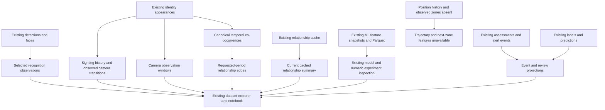

# Proposed read-only camera analytics mart — Stage 1

Stage 2 was subsequently approved and implemented under the no-database-change constraint. See the [implementation and validation report](data_mart_implementation_report.md). The proposal below is retained as the Stage 1 design record.

## Decision

Use a **logical analytical layer over existing production tables**, implemented by consolidating the current query/feature code after approval. No database objects or data will be added or modified. Do not create a schema, SQL view, materialized view, table, index, trigger, extension, role or grant. Do not use Redis, SQLite or file ingestion as a workaround to manufacture a missing database grain.

Existing production behavior continues separately. The proposed read-only analytical path must not call collectors, dataset registration, relationship refresh, threshold activation, label creation, training or service-deployment actions as a side effect of a read.

## Proposed flow

The diagram describes proposed read paths, not new deployed code or a promise of new observation capture.

## Logical contracts (no physical tables/views)

| Query contract | Row grain and key | Inputs and reuse | Bounds/output |
|---|---|---|---|
| Recognition observations | One `faces.id`; preserve detection integer ID/UUID | Existing faces/detections/pipelines; reuse detection storage projection | Required camera/time bounds; numeric similarity and pixel ROI with `frame_dimensions_available=false`; nullable identity/crop |
| Sighting history | One `identity_appearances.id` | Existing appearance event/timeline projection and identity merge lineage | Event/start time plus source/created time; no invented end/track |
| Camera observation windows | `(pipeline_id,window_start,window_seconds)` | Independently aggregate detections, appearances and alert/assessment rows | Default requested 10s, validated positive interval; source-specific counts, distinct observed identities, evidence coverage |
| Temporal co-occurrences | Canonical identities + canonical source appearance IDs + policy/version | Consolidate bounded appearance-overlap logic already used by pair service | Camera/time tolerance and same/cross-camera classification; measurable gap; no physical encounter duration |
| Period relationship edges | Canonical pair + `[period_start,period_end)` + policy/version | Aggregate the preceding matches; keep current cache projection separate | Counts have explicit numerator/denominator, evidence bounds and truncation |
| Assessments/events | `(source_type,source_id)` | Existing assessment/alert/appearance projections | Score type, timestamp basis, source reference; no fabricated anomaly event |
| Review inspection | Existing reviewable source key with optional existing label ID | Existing assessment/label/enrollment/merge workflows | Predictions remain separate from human outcome; no write-on-read |
| Numeric/ML dataset inspection | Existing dataset ID/version and saved row identity | `dataset_explorer.py`, `debug_notebook.py`, `dataset_steps.py`, `scoring.py` | Verify current artifact checksum and preserved historical contract; no new registry row |
| Observed next-camera examples | Identity/session + last input appearance ID + future target appearance ID | Reuse camera-transition/session logic after cutoff correction | Input appearances at/before anchor; observed future camera target separately marked, no interpolation; not a position/zone model |

Use existing auth and pipeline-access checks for every projection, including joins and counts. Preserve identity merge/source IDs for traceability; do not rewrite historical rows or expose raw embeddings. Use an existing authorized database session in explicit read-only mode for analytical queries. The supplied `laf_ai_readonly` grants do not cover all ML tables; report denied access rather than changing grants.

## Computation rules

### Camera windows

Use UTC half-open intervals `[start,end)` and a stable origin. `ANALYTICS_WINDOW_SECONDS=10` would be a validated application/request setting, **not a new database setting row**, if Stage 2 is approved. PostgreSQL 15 `date_bin` supports the interval grouping; confirm and bound all request parameters in the existing query path. See [PostgreSQL date/time documentation](https://www.postgresql.org/docs/15/functions-datetime.html#FUNCTIONS-DATETIME-BIN).

Aggregate each source independently before joining on camera/window to avoid multiplying detections by faces, labels and alerts. Preserve distinction between detection-event count, recognition-result count, and distinct observed identity count. A missing identity is not automatically an unknown identity. Historical unknown status requires the existing audited status reconstruction. Do not return occupancy, vehicle count, entries/exits, active-track count or speed as zero when unavailable.

Dense empty windows are allowed for requested periods, generated in memory or a bounded SELECT. Label them `no_saved_observations` with unknown scene coverage. A camera cross join across months is prohibited by query budgets. Prefer sparse observed windows by default.

### Feature engineering and sequences

Do not add generic transforms just because they are popular. Reuse numeric feature definitions and shared training-only median/coverage logic. Missing values preserve reasons; unavailable normalized coordinates or dynamics remain unavailable, not median-filled into an invented motion feature set.

The requested formulas are valid only if input prerequisites exist:

- Center and box width/height can be derived for stored ROIs, with coordinate-space labels.
- Normalization requires original frame width/height, not crop dimensions. These are absent.
- Velocity requires ordered positions of the same scoped track and positive actual `dt`; acceleration requires successive valid speeds; heading requires a nonzero displacement.
- Duplicate/nonpositive timestamps must not be divided by; gaps/reset/camera changes break a sequence; simultaneous camera sightings do not establish direction.
- No current database position sequence satisfies those prerequisites. Therefore `TRAJECTORY_WINDOW_SECONDS=10` must not imply that a trajectory dataset is available. Do not add a nonfunctional knob.

An observed next-camera dataset is narrower and feasible from existing appearances. Require an explicit UTC as-of cutoff, session-gap policy, stable order and tie handling, source IDs, input/target timestamps, horizon and coverage. The current predictor's history query uses a wall-clock cutoff and no upper as-of bound; it must not be reused unchanged for historical backtesting. Build features strictly before the anchor, keep future observations as targets only, drop examples without a real observed target, and split by time/entity before fitting any transforms. Do not replace the existing predictor or deploy another one in this stage.

### Pair and graph semantics

Canonicalize identity UUIDs using existing helpers. Use source appearance pairs as evidence keys so a self-join does not create both A–B and B–A. Restrict to the requested half-open period before bounded matching; canonicalize appearance IDs as well, retain dedup policy and limits. Do not derive physical overlap from the padding tolerance or a NULL end.

Same-camera matching means co-observation in a tolerated time neighborhood. Cross-camera matching means temporally related sightings at cameras whose configured separation meets a threshold; it is not walking together or proximity between people. Reuse configured/static/activated-threshold precedence and return provenance. A user-requested tighter temporal policy must be explicit and cannot mutate global thresholds.

Compute period edges from the exact same match definition and evidence population. Do not use the lifetime/current cache as if it were an immutable period table. Keep observable count/rate/gap fields separate from model scores and heuristic relationship-strength labels.

### Thresholds, labels and review

Read existing settings, risk-model configurations, `learned_thresholds` and `ml_model_thresholds`. No new business thresholds are hardcoded or persisted by the mart. Apply only thresholds whose units and source grain match: a threshold on saved sightings is not an occupancy threshold; a camera-distance threshold is not person spacing. Unsupported dwell/speed/zone/vehicle metrics return an unavailable reason.

Reuse existing review/outcome semantics. Joining assessment → prediction → existing reviewed label enables inspection where data exists. Preserve original scores and human decisions independently, including review date, reviewer, label definition and supersession. Since live labels/predictions are empty, show an honest empty dataset. Candidate creation and review writes remain existing operational workflows, not analytical read side effects; they are not exercised or extended under the current constraint.

## Code consolidation and cleanup proposed for Stage 2

The user's preference is to edit relevant existing code rather than grow parallel paths. Do not delete code solely because a feature is unused in current data.

| Existing location | Proposed change after approval | Boundary |
|---|---|---|
| `backend/core/intelligence_service.py::_calculate_co_appearances` | Centralize bounded read-only period matching and canonical evidence semantics behind existing callers; expose truncation consistently | Preserve public API shape; do not call destructive cache refresh from read paths |
| `backend/core/security_intelligence_service.py::_calculate_relationships_from_appearances` | Reuse the same period matching contract; remove duplicated interpretation/capping where tests prove equivalence | Existing graph consumers must retain their documented scope |
| `backend/ml/feature_builders.py::build_pair_co_appearance_count` and `relational_feature_service.py` | Align period-count semantics with shared query evidence; audit misleading `90d` naming against actual cache limitations | Existing saved feature/model versions cannot silently change meaning; no historical rewrites |
| `backend/core/trajectory_predictor.py` | Add honest historical as-of filtering and shared deterministic transition extraction; inspect unused travel-time fallback claims (repository search found `_estimate_travel_time` only at its definition) | Keep first-order camera predictor separate from coordinate prediction; no new production predictor |
| `backend/routes/intelligence.py` map security feature helper | Replace synthetic name-derived security-zone presentation with an unavailable explanation when there is no actual zone data | Keep camera locations/valid map journeys; no fabricated polygons presented as observations |
| `backend/ml/dataset_explorer.py`, `debug_notebook.py` | Reuse current preview, source evidence and recorded transforms; show the actual grain, missing prerequisites and status | No separate notebook training workflow; no write-on-read dataset creation |
| `backend/ml/dataset_definitions.py` / existing dataset selection | Represent only supported existing populations and resolve availability before offering capabilities | Read-only inspection only; do not register new datasets or recompute snapshots |
| Existing retention/index/auth code | Reuse unchanged | No migrations, grants, retention changes or new database indexes |

Refactoring selection must follow call-site and compatibility tests. Remove demonstrably unreachable helpers or duplicate code only after that proof; preserve shared functions, public endpoints and historical notebook contracts. Some semantics changes require a version boundary and therefore cannot be slipped into an existing trained model schema under this constraint.

## Performance and volume

Current retained data is small (471 detection rows, 359 sightings, 186 cache pairs), but that does not establish capacity for 30 cameras.

Hypothetical sizing, **not a proposal to start capturing or storing new data**:

| Scenario | Calculation | Rows/day |
|---|---|---:|
| 30 cameras × 5 retained frame observations/s | `30 × 5 × 86,400` | 12,960,000 |
| Position history, mean 5 tracked objects/frame | `30 × 5 × 5 × 86,400` | 64,800,000 |
| Same objects sampled at 1Hz | `30 × 1 × 5 × 86,400` | 12,960,000 |
| Dense 10-second camera windows | `30 × 86,400 / 10` | 259,200 |
| All pairs, mean 5 objects, 5Hz | `30 × 5 × (5×4/2) × 86,400` | 129,600,000 |

An assumed 400–800 bytes per position row including indexes gives roughly 25.9–51.8 GB/day at 64.8M rows, or 778–1,555 GB/30 days, excluding WAL, replicas, backups and images. This is an illustrative budget, not a measured row width, compressed size or throughput result. Current selected-event publication is much sparser than per-frame inference.

For the approved read-only scope: use existing camera/time and identity/time indexes, bounded periods/camera sets, keyset pagination, one grouped query per source, hard limits with explicit truncation and no unbounded N×N join. Compute a camera series or pair graph only for requested scopes; no full-history recomputation on every dashboard refresh. Use EXPLAIN without ANALYZE first when evaluating a proposed query; production performance tests require separate planning.

Partitioning could be relevant to a future high-volume position store, but it requires schema changes and is **excluded**. A partitioned table is not a free read-only view; see [PostgreSQL partitioning](https://www.postgresql.org/docs/15/ddl-partitioning.html). No indexes or materialized aggregation refreshes are proposed now.

## Stage 2 acceptance plan (not executed)

1. Tests enforce that analytical entry points do not flush, commit writes, enqueue mutation jobs or create artifacts/registry rows implicitly.
2. Compare existing consumers before/after query consolidation; preserve public API contracts and access filtering.
3. Test canonical pairing, duplicate observations, same timestamp ties, requested cutoff, late-arriving rows, half-open boundaries, truncation and empty-window meaning.
4. Test 10-second selected-observation counts against independent SQL fixtures; prove joins do not inflate counts.
5. Test unsupported positions/dimensions/zones return unavailable, not zero, imputed dynamics or fake sequence targets.
6. Test human outcome and original prediction remain separate; no fabricated review candidates.
7. Test actual camera-transition ordering and target isolation using generated fixtures in an isolated test environment; no production training.
8. Re-run relevant existing isolated intelligence/notebook tests after actual refactoring. There are **no migration tests to add** because no migrations are allowed.

## Approval checkpoint

Stage 1 concludes with this proposal. No database additions are needed or permitted. Stage 2 is limited to approved edits/consolidation of existing code for supported read-only analytics, plus isolated tests. Full position trajectories, speed/dwell, measured occupancy and next-zone prediction remain unavailable with the existing database. Await user approval before implementation.
